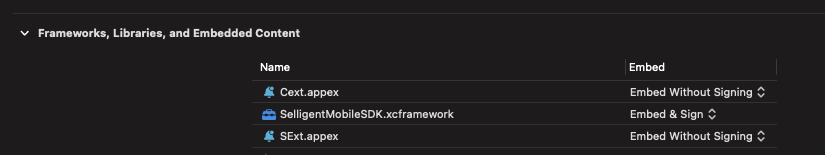

# iOS – Using the SDK

## Foreword

Copyright

The contents of this manual cover material copyrighted by Marigold. Marigold reserves all intellectual property rights on the manual, which should be treated as confidential information as defined under the agreed upon software licence/lease terms and conditions.

The use and distribution of this manual is strictly limited to authorised users of the Marigold Interactive Marketing Software (hereafter the "Software") and can only be used for the purpose of using the Software under the agreed upon software licence/lease terms and conditions. Upon termination of the right to use the Software, this manual and any copies made must either be returned to Marigold or be destroyed, at the latest two weeks after the right to use the Software has ended.

With the exception of the first sentence of the previous paragraph, no part of this manual may be reprinted or reproduced or distributed or utilised in any form or by any electronic, mechanical or other means, not known or hereafter invented, included photocopying and recording, or in any information storage or retrieval or distribution system, without the prior permission in writing from Marigold.

Marigold will not be responsible or liable for any accidental or inevitable damage that may result from unauthorised access or modifications.

User is aware that this manual may contain errors or inaccuracies and that it may be revised without advance notice. This manual is updated frequently.

Marigold welcomes any recommendations or suggestions regarding the manual, as it helps to continuously improve the quality of our products and manuals.

## Table of Contents

- [iOS – Using the SDK](#ios--using-the-sdk)
  - [Foreword](#foreword)
  - [Table of Contents](#table-of-contents)
  - [Intro](#intro)
  - [Create an APNS Key](#create-an-apns-key)
    - [Enable Push Notifications](#enable-push-notifications)
    - [Create a Key](#create-a-key)
  - [Include the SDK in your target](#include-the-sdk-in-your-target)
    - [Swift package import](#swift-package-import)
    - [Cocoapods import](#cocoapods-import)
    - [Manual import](#manual-import)
    - [Using the SDK](#using-the-sdk)
  - [Deep Linking](#deep-linking)
    - [Add entries to your App .plist file](#add-entries-to-your-app-plist-file)
    - [Universal Links](#universal-links)
  - [Starting the SDK](#starting-the-sdk)
    - [Push Notifications](#push-notifications)
    - [Register for Push Notifications](#register-for-push-notifications)
    - [Register for Provisional Push Notifications](#register-for-provisional-push-notifications)
    - [Provide the Device token to the SDK](#provide-the-device-token-to-the-sdk)
    - [Provide Push Notifications status to the SDK](#provide-push-notifications-status-to-the-sdk)
    - [Disable Marigold Engage Push Notifications](#disable-marigold-engage-push-notifications)
    - [Listening and displaying the Push Notifications](#listening-and-displaying-the-push-notifications)
    - [Helper methods](#helper-methods)
    - [Broadcasts](#broadcasts)
  - [In-App Messages](#in-app-messages)
    - [Enable IAM](#enable-iam)
    - [Display IAM](#display-iam)
    - [With SDK helper functions](#with-sdk-helper-functions)
    - [With your own layout](#with-your-own-layout)
    - [Styling IAM](#styling-iam)
    - [Implement WKNavigationDelegate](#implement-wknavigationdelegate)
    - [Display IAM linked to a Push Notification](#display-iam-linked-to-a-push-notification)
    - [Broadcasts](#broadcasts-1)
  - [Events](#events)
    - [Registration / Unregistration](#registration--unregistration)
    - [SMUserEventRegistration](#smusereventregistration)
    - [SMEventUserUnregistration](#smeventuserunregistration)
    - [Login/Logout](#loginlogout)
    - [SMEventUserLogin](#smeventuserlogin)
    - [SMEventUserLogout](#smeventuserlogout)
    - [Custom](#custom)
    - [SMEvent](#smevent)
  - [Notification Extensions](#notification-extensions)
    - [General set up](#general-set-up)
    - [Notification Service Extension](#notification-service-extension)
      - [Service Extension Configuration](#service-extension-configuration)
      - [Service Extension Implementation](#service-extension-implementation)
    - [Notification Content Extension](#notification-content-extension)
      - [Content Extension Configuration](#content-extension-configuration)
      - [Content Extension Implementation](#content-extension-implementation)
  - [Broadcasts summary](#broadcasts-summary)
    - [Event broadcasts](#event-broadcasts)
    - [Data broadcasts](#data-broadcasts)
    - [Examples](#examples)
  - [Miscellaneous](#miscellaneous)
    - [Reload](#reload)
    - [LogLevel](#loglevel)
    - [Retrieve Device Id](#retrieve-device-id)
    - [Notification Service Extension - Manual Implementation](#notification-service-extension---manual-implementation)
    - [Notification Content Extension - Manual Implementation](#notification-content-extension---manual-implementation)

## Intro

The purpose of this document is to detail how to install the SDK into your App and how to easily start using it.

- For more detailed technical reference of the SDK please refer to [**MobileSDK Reference**](MobileSDK%20Reference/#reference-documentation).
- For an example of implementation check the [**IOSSDKTemplate**](IOSSDKTemplate.zip) project.

>**Important Remark:** Core version of the SDK is fully compliant to AppTrackingTransparency framework as we never make any usage of [data used to track the device](https://developer.apple.com/app-store/app-privacy-details/). The device ID is for example a generated ID provided by the Marigold Engage platform to the SDK at launch time.

## Create an APNS Key

### Enable Push Notifications

To enable Push Notifications, go to the [Apple Developer Portal](https://developer.apple.com/) and login to your account.

<details>
  <summary>When logged in, go to the Certificates, Identifiers & Profiles section to manage the certificates.</summary>

  
</details>

<details>
  <summary>In the Certificates, Identifiers & Profiles page go to Identifiers.</summary>

  
</details>

<details>
  <summary>In the list of your App IDs select the App that you want to edit.</summary>

  
</details>

<details>
  <summary>In the list of capabilities enable Push Notifications.</summary>

  
</details>

<details>
  <summary>In this screen you can also note the Bundle ID and Team ID associated to your App as you will need to provide them to Marigold.</summary>

  
</details>

### Create a Key

<details>
  <summary>Back to the Certificates, Identifiers & Profiles page go to Keys and click on the + button to add a new Key.</summary>

  
</details>

<details>
  <summary>Give a name to your Key, enable Apple Push Notifications service (APNS) and click on "continue" and then "register" in the next screen.</summary>

  
  
</details>

<details>
  <summary>In the next screen, carefully read the warning,  note down the Key ID and download it (you can only download the Key once!).</summary><br/>

  
</details>

To use Marigold Engage Push services you will need to provide us with:

- the downloaded **.p8** file
- the **Key ID**
- your **Team ID**
- the **Bundle ID** of the App

## Include the SDK in your target

### Swift package import

To install our SDK via Swift Package Manager, refer to the ([README](../README.md)).

### Cocoapods import

To install our SDK via Cocoapods, refer to the ([README](../README.md)).

### Manual import

<details>
  <summary>Right click on your App target and select "Add Files to YOURTARGET".</summary>

  
</details>

<details>
  <summary>Select the framework(s) folder(s) (the main folder containing the header and the lib files). Depending on your project, check the option "Copy items if needed" and select the "Create groups" option.</summary>

  
</details>

<details>
  <summary>Make sure it is embedded (only) in your main App target. For extension target(s) you just need to import the module in the files where it will be needed.</summary>

  
</details>

### Using the SDK

To start using the SDK, you need to import its module:

Swift

```swift
import SelligentMobileSDK
// OR In App extensions
import SelligentMobileExtensionsSDK
```

Objective-C

```objective-c
@import SelligentMobileSDK;
// OR In App extensions
@import SelligentMobileExtensionsSDK;
```

## Deep Linking

### Add entries to your App .plist file

You should configure correctly the **plist** of your App to allow this to work, by registering a custom URL scheme:

```xml
<key>CFBundleURLTypes</key>
<array>
  <dict>
    <key>CFBundleURLName</key>
    <string>yourappbundle</string>
    <key>CFBundleURLSchemes</key>
    <array>
      <string>yourscheme</string>
    </array>
  </dict>
</array> 
```

You will also have to add `LSApplicationQueriesSchemes` Key, with your scheme as string, to allow your App to open the URL:

```xml
<key>LSApplicationQueriesSchemes</key>
<array>
  <string>appscheme</string>
</array> 
```

By doing this, you will be able to parse the URL and process it like you want in openURL.

Swift

```swift
// When the SDK calls for example:
let url = URL(string: "yourscheme://anypage")!
UIApplication.shared.openURL(url)

// What you need to implement in your AppDelegate:
func application(_ app: UIApplication, open url: URL, options: [UIApplication.OpenURLOptionsKey : Any] = [:]) -> Bool {
    // Here you will be able to parse your url 
    print(url.absoluteString)
    return true
} 
```

Objective-C

```objective-c
// When the SDK calls for example:
NSURL *url = [NSURL URLWithString:@"yourscheme://anypage"];
[[UIApplication sharedApplication] openURL:url];

// What you need to implement in your AppDelegate:
- (BOOL) application:(UIApplication *)app openURL:(NSURL *)url options:(NSDictionary<UIApplicationOpenURLOptionsKey,id> *)options {
    // Here you will be able to parse your url
    NSLog(@"%@", [url absoluteString]);
    return true;
}
```

If everything is correctly set then when the user receives a Push and clicks it, the App will open, and it will trigger the `appscheme://anypage`.

### Universal Links

By default, universal links in a button from a Push/IAM/IAC will open the default browser, to avoid this and catch them on the App and apply any logic you want, you will need to create a class that implements the `SMManagerUniversalLinksDelegate` and provide it to the SDK.

> The delegate will only get triggered from `deeplink` button types defined in Marigold Engage, whose URL scheme is `http` or `https`.

Swift
  
```swift
// Provide an instance of a class implementing SMManagerUniversalLinksDelegate to the SDK (you can do that for example at launch time)
SMManager.shared.universalLinksDelegate(AppUniversalLinksDelegateExample())

// Your class will look like
class AppUniversalLinksDelegateExample: NSObject, SMManagerUniversalLinksDelegate {
    func executeLinkAction(_ url: URL) {
        // Your code to handle the universal link being executed
        print(url)
    }
}
```

Objective-C

```objective-c
// Provide an instance of a class implementing SMManagerUniversalLinksDelegate to the SDK (you can do that for example at launch time)
[[SMManager shared] universalLinksDelegate:[AppUniversalLinksDelegateExample new]];

// Your class will look like
// AppUniversalLinksDelegateExample.h
@import SelligentMobileSDK;

@interface AppUniversalLinksDelegateExample : NSObject <SMManagerUniversalLinksDelegate>
@end

// AppUniversalLinksDelegateExample.m
#import "AppUniversalLinksDelegateExample.h"

@implementation AppUniversalLinksDelegateExample

- (void) executeLinkAction:(NSURL *)url {
    // Your code to handle the universal link being executed
    NSLog(@"%@", url);
}

@end
```

## Starting the SDK

To start the library, please follow the steps below (will mainly happen in your `UIApplication`'s delegate).
The following must be done in:

Swift

```swift
func application(_ application: UIApplication, didFinishLaunchingWithOptions launchOptions: [UIApplication.LaunchOptionsKey: Any]?) -> Bool
```

Objective-C

```objective-c
- (BOOL) application:(UIApplication *)application didFinishLaunchingWithOptions:(NSDictionary *)launchOptions
```

- Create an instance of `SMManagerSetting` with the **url**, **clientId** and **privateKey** provided by Marigold.
- Set the following optional properties according to your needs:
  
  | Property | Description |
  | --------- | --------- |
  | `shouldClearBadge` | If you want the SDK to manage badge clearance. |
  | `shouldDisplayRemoteNotification` | If you want to prevent the display of Push Notifications by the SDK and manage it in your App ([learn more](#helper-methods)). |
  | `shouldAddInAppMessageFromPushToInAppMessageList` | If you want to add the In-App Message associated to a Push Notification to the In-App Message list ([learn more](#display-iam)). |
  | `clearCacheIntervalValue` | Define the interval value to clear the SDK internal cache (this setting is only used for messages that do not have an expiration date – otherwise expiration date of the message will be taken into account for lifetime of the message in cache). |
  | `appGroupId` | Provide the App GroupId to the SDK (`group.yourGroupName`) that you will have previously configured in your Apple Developer Portal. This is mandatory when you use one Notification extension (service and/or content) ([learn more](#notification-extensions)). |
  | `remoteMessageDisplayType` | This value defines the behavior that the SDK will adopt when a remote-notification is received when in Foreground ([learn more](MobileSDK%20Reference/classes/SMManagerSetting.md#/api/name/remoteMessageDisplayType)). |
  
 - Optionally initialize and configure In-App Messages.

Swift

```swift
let url = "YourProvidedURL"
let clientId = "YourClientId"
let privateKey = "YourPrivateKey"

// Create the SMManagerSetting instance
let settings = try! SMManagerSetting(url: url, clientId: clientId, privateKey: privateKey)

// Optional - Default value is true
settings.shouldClearBadge = true
settings.shouldDisplayRemoteNotification = true
settings.shouldAddInAppMessageFromPushToInAppMessageList = false

// Optional - Default value is .auto
settings.clearCacheIntervalValue = .auto

// Only mandatory when you want to use a Notification extension (service or/and content)
settings.appGroupId = "group.yourGroupName"

// Optional - Initialize In-App Messages settings
let settingIAM = SMManagerSettingIAM(refreshType: .daily)
settings.configureInAppMessageService(with: settingIAM)

// Optional - Define the SDK behavior when receiving push notifications in foreground
// Make sure you have read this setting's documentation from SMManagerSetting reference, before using it
// settings.remoteMessageDisplayType = .notification
```

Objective-C

```objective-c
NSString *url = @"YourProvidedURL";
NSString *clientId = @"YourClientId";
NSString *privateKey = @"YourPrivateKey";

// Create the SMManagerSetting instance
SMManagerSetting *settings = [[SMManagerSetting alloc] initWithUrl:url clientId:clientId privateKey:privateKey error:nil];

// Optional - Default value is true
settings.shouldClearBadge = true;
settings.shouldDisplayRemoteNotification = true;
settings.shouldAddInAppMessageFromPushToInAppMessageList = false;

// Optional - Default value is kSMClearCache_Auto
settings.clearCacheIntervalValue = kSMClearCache_Auto;
// Only mandatory when you want to use a Notification extension (Services or/and Content)
settings.appGroupId = @"group.yourGroupName";

// Initialize In-App Messages settings - other constructors exist (cf. documentation)
SMManagerSettingIAM *iamSetting = [[SMManagerSettingIAM alloc] initWithRefreshType:kSMIA_RefreshType_Daily backgroundFetch:false];
[settings configureInAppMessageServiceWith:iamSetting];

// Optional - Define the SDK behavior when receiving push notifications in foreground
// Make sure you have read this setting's documentation from SMManagerSetting reference, before using it
// settings.remoteMessageDisplayType = kSMRemoteMessageDisplayType_Notification;
```

**Mandatory**: call the `start` API of the SDK right afterwards.

Swift

```swift
// Starting the SDK
SMManager.shared.start(with: settings)
```

Objective-C

```objective-c
// Starting the SDK
[[SMManager shared] startWith:settings];
```

### Push Notifications

### Register for Push Notifications

Starting the library won't register for Push Notifications. You will need to call:

Swift

```swift
SMManager.shared.registerForRemoteNotification()
```

  Objective-C

```objective-c
[[SMManager shared] registerForRemoteNotification];
```

This can be called whenever you need to do it in your App.
> If you plan to trigger this when a certain page or criteria is met, do take into account to also trigger it for users that have already given the Push permission in a previous version of the App without the Marigold Engage SDK.<br>
> Not doing so would make it impossible for Marigold Engage to receive the necessary **device push token**, to be used when sending Push Notifications.

<details>
  <summary>You can then customize the way you inform the user before the display of iOS alert which will let the user allow Push Notifications for the App on the device (the iOS alert is displayed only once).</summary>

  
</details>

### Register for Provisional Push Notifications

> This option is only available for iOS 12+.

You can also decide to first ask for the Provisional push authorization (which will provide a valid push token but will not show any prompt to the user), if you want to contact users that did not decide about the Push permission yet (you can call `registerForRemoteNotification` later and it will still display the push permission prompt to the user).

Swift

```swift
SMManager.shared.registerForProvisionalRemoteNotification()
```

Objective-C

```objective-c
[[SMManager shared] registerForProvisionalRemoteNotification];
```

> If you want to segmentate your campaigns based on the type of authorization (provisional/normal), you can contact your Marigold Engage TC or our support team to make the necessary configurations in the platform, to have it available.

### Provide the Device token to the SDK

If the user has accepted to receive Push Notifications, the device will be given a **device push token** by Apple, that you must provide to the Marigold Engage platform. To do that you must implement:

Swift

```swift
func application(_ application: UIApplication, didRegisterForRemoteNotificationsWithDeviceToken deviceToken: Data) {
    SMManager.shared.didRegisterForRemoteNotifications(deviceToken: deviceToken)
}
```

Objective-C

```objective-c
- (void) application:(UIApplication *)application didRegisterForRemoteNotificationsWithDeviceToken:(NSData *)deviceToken {
    [[SMManager shared] didRegisterForRemoteNotificationsWithDeviceToken:deviceToken];
}
```

### Provide Push Notifications status to the SDK

> Optional, the SDK is able to get this information by itself. It is useful though for debugging possible issues.

Swift

```swift
func application(_ application: UIApplication, didFailToRegisterForRemoteNotificationsWithError error: Error) {
    SMManager.shared.didFailToRegisterForRemoteNotifications(with: error)
}
```

Objective-C

```objective-c
- (void) application:(UIApplication *)application didFailToRegisterForRemoteNotificationsWithError:(NSError *)error {
    [[SMManager shared] didFailToRegisterForRemoteNotificationsWithError:error];
}
```

### Disable Marigold Engage Push Notifications

By default, Marigold Engage Push Notifications are enabled and, if the device is correctly registered to iOS, then you don't have anything else to do.

But if you want to disable (or enable) Marigold Engage Pushes only (and still be able to receive other third party pushes), you have the possibility to do so by using:

Swift

```swift
SMManager.shared.enableRemoteNotification()
SMManager.shared.disableRemoteNotification()
```

Objective-C

```objective-c
[[SMManager shared] enableRemoteNotification];
[[SMManager shared] disableRemoteNotification];
```

Keep in mind that if, at device level, the Push Notifications are not registered and enabled then `enableRemoteNotification` won't be enough to receive Marigold Engage Pushes.

### Listening and displaying the Push Notifications

Implement the below methods to properly display and react to push notifications.

Swift

```swift
class AppDelegate: UIResponder, UIApplicationDelegate, UNUserNotificationCenterDelegate {
    func application(_ application: UIApplication, didFinishLaunchingWithOptions launchOptions: [UIApplicationLaunchOptionsKey : Any]?) -> Bool {
    // Other code
    UNUserNotificationCenter.current().delegate = self
    // Start the SDK below
}

func userNotificationCenter(_ center: UNUserNotificationCenter, willPresent notification: UNNotification, withCompletionHandler completionHandler: @escaping(UNNotificationPresentationOptions) -> Void) {
    // See SMManagerSetting reference for more information about how the SDK handles the display of pushs in foreground
    SMManager.shared.willPresent(notification, completionHandler: completionHandler)
    
    // OR if you want to give specific styling to this particular IAM (different than the global styling provided in `SMManagerSetting/configureInAppMessageService(with:)`)
    // It will only work when the completionHandler is passed to the SDK and the `SMManagerSetting/remoteMessageDisplayType` value is `.automatic`
    // SMManager.shared.willPresent(notification, options: SMInAppMessageStyleOptions, completionHandler: completionHandler)
    
    // OR if you want to use specific UNNotificationPresentationOptions
    // SMManager.shared.willPresent(notification, completionHandler: nil)
    // completionHandler(.alert)
}

func userNotificationCenter(_ center: UNUserNotificationCenter, didReceive response: UNNotificationResponse, withCompletionHandler completionHandler: @escaping() -> Void) {
    SMManager.shared.didReceive(response)
    
    // OR if you want to give specific styling to this particular IAM (different than the global styling provided in `SMManagerSetting/configureInAppMessageService(with:)`)
    // SMManager.shared.didReceive(response, options: SMInAppMessageStyleOptions)
    completionHandler()
}
```

Objective-C

```objective-c
// AppDelegate.h
#import <UserNotifications/UserNotifications.h>

@interface AppDelegate: UIResponder<UIApplicationDelegate, UNUserNotificationCenterDelegate>

// AppDelegate.m
- (BOOL) application:(UIApplication *)application didFinishLaunchingWithOptions:(NSDictionary *)launchOptions {
    // Other code
    UNUserNotificationCenter *center = [UNUserNotificationCenter currentNotificationCenter];
    center.delegate = self;
    // Start the SDK below
}

- (void) userNotificationCenter:(UNUserNotificationCenter *)center willPresentNotification:(UNNotification *)notification withCompletionHandler:(void(^)(UNNotificationPresentationOptions))completionHandler {
    // See SMManagerSetting reference for more information about how the SDK handles the display of pushs in foreground
    [[SMManager shared] willPresent:notification options:nil completionHandler:completionHandler];
    
    // OR if you want to give specific styling to this particular IAM (different than the global styling provided in `SMManagerSetting/configureInAppMessageService(with:)`)
    // It will only work when the completionHandler is passed to the SDK and the `SMManagerSetting/remoteMessageDisplayType` value is `kSMRemoteMessageDisplayType_Automatic`
    // [[SMManager shared] willPresent:notification options:SMInAppMessageStyleOptions completionHandler:completionHandler];
        
    // OR if you want to use specific UNNotificationPresentationOptions
    // [[SMManager shared] willPresentNotification:notification options:nil completionHandler:nil];
    // completionHandler(UNNotificationPresentationOptionAlert);
}

- (void) userNotificationCenter:(UNUserNotificationCenter *)center didReceiveNotificationResponse:(UNNotificationResponse *)response withCompletionHandler:(void(^)(void))completionHandler {
    [[SMManager shared] didReceive:response options:nil];
    
    // OR if you want to give specific styling to this particular IAM (different than the global styling provided in `SMManagerSetting/configureInAppMessageService(with:)`)
    // [[SMManager shared] didReceive:response options:SMInAppMessageStyleOptions];
    completionHandler();
}
```

> You can also implement specific delegates when your App supports background modes ([learn more](MobileSDK%20Reference/Categories/SMManager+SilentPush.md)).

### Helper methods

There are some useful methods which allow you to manage when you want to display the Push Notification in your own way, when `SMManagerSetting/shouldDisplayRemoteNotification` is set to `false` or when working with different `SMManagerSetting/remoteMessageDisplayType` values (and the App is in foreground).

Swift

```swift
// Retrieves the SMNotificationMessage object from the given userInfo Dictionary, if any
SMManager.shared.retrieveNotificationMessage(userInfo)

// Given a valid SMNotificationMessage, the SDK will send the corresponding Opened event to the Marigold Engage platform
SMManager.shared.setNotificationMessageAsSeen(notificationMessage)

// Given a valid SMLink and SMNotificationMessage, the SDK will send the corresponding Clicked event to the Marigold Engage platform
SMManager.shared.setLinkAsClicked(link, from: notificationMessage)

// Displays the last received Push Notification
SMManager.shared.displayLastReceivedNotification()

// Display last received Push Notification content
SMManager.shared.displayLastReceivedNotificationContent()
// OR if you want to give specific styling to this particular IAM (different than the global styling provided in `SMManagerSetting/configureInAppMessageService(with:)`)
// SMManager.shared.displayLastReceivedNotificationContent(options: SMInAppMessageStyleOptions?)

// Retrieve last Push Notification content (SMNotificationMessage)
SMManager.shared.retrieveLastReceivedNotificationContent()
```

Objective-C

```objective-c
// Retrieves the SMNotificationMessage object from the given userInfo Dictionary, if any
[[SMManager shared] retrieveNotificationMessage:userInfo];

// Given a valid SMNotificationMessage, the SDK will send the corresponding Opened event to the Marigold Engage platform
[[SMManager shared] setNotificationMessageAsSeen:notificationMessage];

// Given a valid SMLink and SMNotificationMessage, the SDK will send the corresponding Clicked event to the Marigold Engage platform
[[SMManager shared] setLinkAsClicked:link from:notificationMessage];

// Displays the last received Push Notification
[[SMManager shared] displayLastReceivedNotification];

// Display last received Push Notification content
[[SMManager shared] displayLastReceivedNotificationContentWithOptions:nil];
// OR if you want to give specific styling to this particular IAM (different than the global styling provided in `SMManagerSetting/configureInAppMessageService(with:)`)
// [[SMManager shared] displayLastReceivedNotificationContentWithOptions:SMInAppMessageStyleOptions];

// Retrieve last Push Notification content (SMNotificationMessage)
[[SMManager shared] retrieveLastReceivedNotificationContent];
```

### Broadcasts

| Name | Type | Description |
| --------- | --------- | --------- |
| `SMConstants.kSMNotification_Event_ButtonClicked` | `NSNotification` name | It is broadcasted when the user interacts with a Remote Notification. It can be used to retrieve user action on a received remote-notification. |
| `SMConstants.kSMNotification_Event_WillDisplayNotification` | `NSNotification` name | It is broadcasted shortly before displaying a Remote Notification's content'. It can be used to pause any ongoing work before the Remote Notification is displayed. This notification-name is also triggered even if you disable `shouldDisplayRemoteNotification` ([learn more](MobileSDK%20Reference/classes/SMManagerSetting.md)). |
| `SMConstants.kSMNotification_Event_WillDismissNotification` | `NSNotification` name | It is broadcasted shortly before dismissing the current Remote Notification's content'. It can be used to resume any paused work (see `SMConstants.kSMNotification_Event_WillDisplayNotification`). |
| `SMConstants.kSMNotification_Event_DidReceiveRemoteNotification` | `NSNotification` name | It is broadcasted shortly after receiving a Remote Notification. It can be used to decide when to display a remote-notification. |
| `SMConstants.kSMNotification_Data_ButtonData` | `String` Key | Use this Key to retrieve the object [SMLink](MobileSDK%20Reference/classes/SMLink.md), from the NSNotification-name `SMConstants.kSMNotification_Event_ButtonClicked`. |
| `SMConstants.kSMNotification_Object_RemoteNotification` | `String` Key | Use this Key to retrieve a `SMNotificationMessage` instance with the Push content, from the NSNotification-name `SMConstants.kSMNotification_Event_DidReceiveRemoteNotification`. |

Examples can be found [here](#examples).

## In-App Messages

### Enable IAM

If In-App Messages (we will refer to them with IAM) are correctly configured ([learn more](#starting-the-sdk)), you will need to enable them once, wherever you want in your App (but after calling the `SMManager/start(with:)`), by calling:

- Swift

```swift
SMManager.shared.enable(inAppMessage: true)

// This helper method will return the current state of the in-app message service
let state = SMManager.shared.areInAppMessagesEnabled()
```

Objective-C

```objective-c
[[SMManager shared] enableInAppMessage:true];

// This helper method will return the current state of the in-app message service
kSMInAppMessageServiceState_ state = [[SMManager shared] areInAppMessagesEnabled];
```

> It is also possible to fetch IAM in background mode ([learn more](MobileSDK%20Reference/classes/SMManagerSettingIAM.md)).

### Display IAM

To retrieve the IAM delivered to the device you must listen to `SMConstants.kSMNotification_Event_DidReceiveInAppMessage` ([learn more](#broadcasts-1)).

### With SDK helper functions

This will provide you an `Array` of `Dictionary` containing 2 properties: **id** and **title**, for each **new** IAM available for the device (for the full list of known + new IAM you can use `SMManager/getInAppMessages()`, check next documentation section)

Swift

```swift
NotificationCenter.default.addObserver(self, selector: #selector(didReceiveInAppMessage(_:)), name: NSNotification.Name(rawValue: SMConstants.kSMNotification_Event_DidReceiveInAppMessage), object: nil)

@objc func didReceiveInAppMessage(_ notif: Notification) {
    let dictIAM = notif.userInfo
    let array = dictIAM![SMConstants.kSMNotification_Object_InAppMessage] as! [SMInAppMessage]
}
```

Objective-C

```objective-c
[[NSNotificationCenter defaultCenter] addObserver:self selector:@selector(didReceiveInAppMessage:) name:SMConstants.kSMNotification_Event_DidReceiveInAppMessage object:nil];

- (void) didReceiveInAppMessage:(NSNotification *)notif {
    NSDictionary *dictIAM = [notif userInfo];
    NSMutableArray *arrayIAM = [dictIAM objectForKey:SMConstants.kSMNotification_Object_InAppMessage];
}
```

Once your IAM is retrieved you can for example create an inbox page and when the user clicks on the IAM you can tell the SDK to display it calling:

Swift

```swift
SMManager.shared.displayInAppMessage(id: "notificationID")
// OR if you want to give specific styling to this particular IAM (different than the global styling provided in `SMManagerSetting/configureInAppMessageService(with:)`)
// SMManager.shared.displayInAppMessage(id: "notificationID", options: SMInAppMessageStyleOptions?)
```

Objective-C

```objective-c
[[SMManager shared] displayInAppMessageWithId:@"notificationID" options:nil];
// OR if you want to give specific styling to this particular IAM (different than the global styling provided in `SMManagerSetting/configureInAppMessageService(with:)`)
// [[SMManager shared] displayInAppMessageWithId:@"notificationID" options:SMInAppMessageStyleOptions];
```

### With your own layout

Once notified that new IAM are available, you can access all their properties from App side (so you can display them with your own UI), you can also request for the full list of `not-expired` IAM to the SDK. This will give you more flexibility when displaying them.

Swift

```swift
// This method will provide you an array of SMInAppMessage, all received and not expired IAM
let inAppMessages = SMManager.shared.getInAppMessages()

if inAppMessages.count > 0 {
    // If an IAM has links associated to it, you can retrieve them with arrayIAMLinks on the SMInAppMessage object, you can then display the link the way you prefer,
    let message = inAppMessages.first!
    let link = message.arrayIAMLinks.first!

    // and once the user has clicked the link you will have to do a call to executeLinkAction
    SMManager.shared.executeLinkAction(link, inAppMessage: message)

    // When an IAM has been displayed to the user you will have to mandatory call
    // This will permit to the Marigold Engage platform to set the adequate (open) event to the IAM
    SMManager.shared.setInAppMessageAsSeen(message)

    // If you wish to remove the flag of a message as seen you can do so (this won't change the event state at platform level)
    SMManager.shared.setInAppMessageAsUnseen(message)

    // This helper method that will allow you to set a message as deleted (in this case the message won't be provided to you anymore)
    SMManager.shared.setInAppMessageAsDeleted(message)
}
```

Objective-C

```objective-c
// This method will provide you an array of SMInAppMessage, all received and not expired IAM
NSArray *inAppMessages = [[SMManager shared] getInAppMessages];

if (inAppMessages.count > 0) {
    SMInAppMessage *message = inAppMessages.firstObject;

    // If an IAM has links associated to it, you can retrieve them with arrayIAMLinks on the SMInAppMessage object, you can then display the link the way you prefer,
    // and once the user has clicked the link you will have to do a call to executeLinkAction
    [[SMManager shared] executeLinkAction:message.arrayIAMLinks.firstObject inAppMessage:message];

    // When an IAM has been displayed to the user you will have to mandatory call
    // This will permit to the Marigold Engage platform to set the adequate (open) event to the IAM
    [[SMManager shared] setInAppMessageAsSeen:message];

    // If you wish to remove the flag of a message as seen you can do so (this won't change the event state at platform level)
    [[SMManager shared] setInAppMessageAsUnseen:message];

    // This helper method that will allow you to set a message as deleted (in this case the message won't be provided to you anymore)
    [[SMManager shared] setInAppMessageAsDeleted:message];
}
```

### Styling IAM

Since SDK v3.0.0 you can now easily personalize the way IAM are displayed without needing to do it via global `.appearance()`.
You need to set it before configuring your IAM service `SMManagerSetting/configureInAppMessageService(with:)` and before starting the SDK `SMManager/start(with:)`.
Additionally, you can replace the default SDK images used in the navigation bar by having any of the following `image assets` in your main app's bundle: `SM.Close`, `SM.Menu`, `SM.Back`, `SM.Forward` and `SM.Reload`. Make sure the width and height of these assets are equal and that they are transparent PNG/vector image.
You can also use `navigationMenuButtonAlternateAssetName`, `navigationCloseButtonAlternateAssetName`, `navigationArrowBackButtonAlternateAssetName`,  `navigationArrowForwardButtonAlternateAssetName` and `reloadButtonAlternateAssetName` properties to use different images depending on the IAM (or from where is it being displayed)

Swift

```swift
// Switch to .hourly or .daily if you want to treat standalone inapp messages too
let iamSetting = SMManagerSettingIAM(refreshType: .hourly)

// Applies to any type of inapp message
iamSetting.styleOptions.linksColor = .blue

// Applies to inapp messages of type image, html, map and url
iamSetting.styleOptions.navigationTitleColor = .black
iamSetting.styleOptions.navigationTitleFont = .systemFont(ofSize: 20, weight: .bold)
iamSetting.styleOptions.navigationBackgroundColor = .cyan
iamSetting.styleOptions.navigationMenuButtonColor = .blue
iamSetting.styleOptions.navigationCloseButtonColor = .red
iamSetting.styleOptions.viewBackgroundColor = .cyan
iamSetting.styleOptions.navigationMenuCloseButtonSwitchPosition = false
iamSetting.styleOptions.presentWithTransition = true
iamSetting.styleOptions.transition = .horizontalSlide
iamSetting.styleOptions.transitioningDelegate = nil

// Applies to inapp messages of type url
iamSetting.styleOptions.navigationArrowButtonsColor = .black

// Applies to inapp messages of type image and url
iamSetting.styleOptions.reloadButtonColor = .cyan

// Applies to inapp messages of type image
iamSetting.styleOptions.imageCanBeTapped = true

// Applies to inapp messages of type alert
iamSetting.styleOptions.alertBackgroundColor = .cyan
iamSetting.styleOptions.alertTitleColor = .red
iamSetting.styleOptions.alertTitleFont = .systemFont(ofSize: 20, weight: .semibold)
iamSetting.styleOptions.alertBodyFont = .systemFont(ofSize: 17)
iamSetting.styleOptions.alertBodyColor = .gray
iamSetting.styleOptions.alertLinksSeparatorColor = .white
iamSetting.styleOptions.alertCornerRadius = 15
iamSetting.styleOptions.alertLinksBackgroundColor = .red
iamSetting.styleOptions.alertLinksFont = .systemFont(ofSize: 17)
iamSetting.styleOptions.alertLinksColor = .black

settings.configureInAppMessageService(with: iamSetting)
```

Objective-C

```objective-c
// Switch to kSMIA_RefreshType_Hourly or kSMIA_RefreshType_Daily if you want to implement standalone inapp messages too
SMManagerSettingIAM *iamSetting = [[SMManagerSettingIAM alloc] initWithRefreshType:kSMIA_RefreshType_None backgroundFetch:false];

// Applies to any type of inapp message
iamSetting.styleOptions.linksColor = UIColor.blueColor;

// Applies to inapp messages of type image, html, map and url
iamSetting.styleOptions.navigationTitleColor = UIColor.blackColor;
iamSetting.styleOptions.navigationTitleFont = [UIFont systemFontOfSize:20 weight:UIFontWeightBold];
iamSetting.styleOptions.navigationBackgroundColor = UIColor.cyanColor;
iamSetting.styleOptions.navigationMenuButtonColor = UIColor.blueColor;
iamSetting.styleOptions.navigationCloseButtonColor = UIColor.redColor;
iamSetting.styleOptions.viewBackgroundColor = UIColor.cyanColor;
iamSetting.styleOptions.navigationMenuCloseButtonSwitchPosition = false;
iamSetting.styleOptions.presentWithTransition = true;
iamSetting.styleOptions.transition = kSMViewTransition_HorizontalSlide;
iamSetting.styleOptions.transitioningDelegate = nil;

// Applies to inapp messages of type url
iamSetting.styleOptions.navigationArrowButtonsColor = UIColor.blackColor;

// Applies to inapp messages of type image and url
iamSetting.styleOptions.reloadButtonColor = UIColor.cyanColor;

// Applies to inapp messages of type image
iamSetting.styleOptions.imageCanBeTapped = true;

// Applies to inapp messages of type alert
iamSetting.styleOptions.alertBackgroundColor = UIColor.cyanColor;
iamSetting.styleOptions.alertTitleColor = UIColor.redColor;
iamSetting.styleOptions.alertTitleFont = [UIFont systemFontOfSize:20 weight:UIFontWeightSemibold];
iamSetting.styleOptions.alertBodyFont = [UIFont systemFontOfSize:17];
iamSetting.styleOptions.alertBodyColor = UIColor.grayColor;
iamSetting.styleOptions.alertLinksSeparatorColor = UIColor.whiteColor;
iamSetting.styleOptions.alertCornerRadius = 15;
iamSetting.styleOptions.alertLinksBackgroundColor = UIColor.redColor;
iamSetting.styleOptions.alertLinksFont = [UIFont systemFontOfSize:17];
iamSetting.styleOptions.alertLinksColor = UIColor.blackColor;

[settings configureInAppMessageServiceWith:iamSetting];
```

### Implement WKNavigationDelegate

When an IAM of type URL/PAGE is displayed by the SDK in a webView, if you wish for example to process the clicked link inside the webView on the App side, the SDK gives you the ability to do so by having a class in your App that implements the `WKNavigationDelegate` and providing an instance of this class to the SDK.

> This is necessary if you want to have deep and universal links working from within this type of SDK IAM.

To achieve this, you can call the method `SMManager/inAppMessageWKNavigationDelegate(_:)` and give the instance of the class that will be in charge of implementing the `WKNavigationDelegate` methods as parameter.

You will also need to call `SMManager/removeViewController()` whenever you wish to close the webView controller displayed by the SDK.

Swift

```swift
// Provide an instance of a class implementing WKNavigatonDelegate to the SDK (you can do that for example at launch time)
SMManager.shared.inAppMessageWKNavigationDelegate(AppWKNavigationDelegateExample())

// Your class will look like
class AppWKNavigationDelegateExample: NSObject, WKNavigationDelegate {
    func webView(_ webView: WKWebView, decidePolicyFor navigationAction: WKNavigationAction, decisionHandler: @escaping (WKNavigationActionPolicy) -> Void) {
        if navigationAction.navigationType == .linkActivated  {
            if let url = navigationAction.request.url,
            let host = url.host, host.hasPrefix("myDomain"),
            UIApplication.shared.canOpenURL(url) {
                // Logic here to show your App page
                // Remove SDK's webView controller
                SMManager.shared.removeViewController()
                decisionHandler(.cancel)
                return
            }
        }
        
        decisionHandler(.allow)
    }
 
    // The below functions are necessary to keep the SDK webview working properly
    func webView(_ webView: WKWebView, didFail navigation: WKNavigation!, withError error: Error) {
        SMManager.shared.webView(webView, didFail: navigation, withError: error)
    }
 
    func webView(_ webView: WKWebView, didFinish navigation: WKNavigation!) {
        SMManager.shared.webView(webView, didFinish: navigation)
    }
        
    func webView(_ webView: WKWebView, didCommit navigation: WKNavigation!) {
        SMManager.shared.webView(webView, didCommit: navigation)
    }
    
    func webView(_ webView: WKWebView, didFailProvisionalNavigation navigation: WKNavigation!, withError error: Error) {
        SMManager.shared.webView(webView, didFailProvisionalNavigation: navigation, withError: error)
    }
}
```

Objective-C

```objective-c
// Provide an instance of a class implementing WKNavigatonDelegate to the SDK (you can do that for example at launch time)
[[SMManager shared] inAppMessageWKNavigationDelegate:[AppWKNavigationDelegateExample new]];

// Your class will look like
// AppWKNavigationDelegateExample.h
#import <WebKit/WebKit.h>
#import <Foundation/Foundation.h>

@interface AppWKNavigationDelegateExample: NSObject<WKNavigationDelegate>
@end

// AppWKNavigationDelegateExample.m
#import "AppWKNavigationDelegateExample.h"
@import SelligentMobileSDK;

@implementation AppWKNavigationDelegateExample

- (void)webView:(WKWebView *)webView decidePolicyForNavigationAction:(nonnull WKNavigationAction *)navigationAction decisionHandler:(nonnull void(^)(WKNavigationActionPolicy))decisionHandler {
    if navigationAction.navigationType == WKNavigationTypeLinkActivated {
        if navigationAction.request.URL {
            if ![navigationAction.request.URL.resourceSpecifier containsString:@"myDomain"] {
                // Logic here to show your App page
                // Remove SDK's webView controller
                [[SMManager shared] removeViewController];
                decisionHandler(WKNavigationActionPolicyCancel);
                return;
            }
        }
    }
    
    decisionHandler(WKNavigationActionPolicyAllow);
}

// The below functions are necessary to keep the SDK webview working properly
- (void) webView:(WKWebView *)webView didFailNavigation:(WKNavigation *)navigation withError:(NSError *)error {
    [[SMManager shared] webView:webView didFail: navigation withError:error];
}

- (void) webView:(WKWebView *)webView didFinishNavigation:(WKNavigation *)navigation {
    [[SMManager shared] webView:webView didFinish:navigation];
}

- (void) webView:(WKWebView *)webView didCommitNavigation:(WKNavigation *)navigation {
    [[SMManager shared] webView:webView didCommit:navigation];
}

- (void)webView:(WKWebView *)webView didFailProvisionalNavigation:(WKNavigation *)navigation withError:(NSError *)error {
    [[SMManager shared] webView:webView didFailProvisionalNavigation:navigation withError:error];
}

@end
```

### Display IAM linked to a Push Notification

When an IAM is available with the payload of a Push Notification, you can also decide to process its content and display it on App side.

To achieve this, you can call the method `SMManager/inAppMessageDelegate(_:)` and give the instance of the class that will be in charge of implementing the `SMManagerInAppMessageDelegate` methods as a parameter.

Swift

```swift
// Provide an instance of a class implementing SMManagerInAppMessageDelegate to the SDK (you can do that for example at launch time)
SMManager.shared.inAppMessageDelegate(AppInAppMessageDelegateExample())

// Your class will look like
class AppInAppMessageDelegateExample: NSObject,SMManagerInAppMessageDelegate {
    // This will be called when the IAM (from a Push Notification) would be about to be displayed
    func display(_ inAppMessage: SMInAppMessage) {
        print(inAppMessage.title)
        print(inAppMessage.body)
        //print(inAppMessage.arrayIAMLinks)
    }
}
```

Objective-C

```objective-c
// Provide an instance of a class implementing SMManagerInAppMessageDelegate to the SDK (you can do that for example at launch time)
[[SMManager shared] inAppMessageDelegate:[AppInAppMessageDelegateExample new]];

// Your class will look like
// AppInAppMessageDelegateExample.h
#import <Foundation/Foundation.h>
@import SelligentMobileSDK;

@interface AppInAppMessageDelegateExample: NSObject<SMManagerInAppMessageDelegate>
@end

// AppInAppMessageDelegateExample.m
#import "AppInAppMessageDelegateExample.h"
@import SelligentMobileSDK;

@implementation AppInAppMessageDelegateExample

// This will be called when the IAM (from a Push Notification) would be about to be displayed
- (void) display:(SMInAppMessage *)inAppMessage {
    NSLog(@"title :%@", inAppMessage.title);
    NSLog(@"content :%@", inAppMessage.body);
    //NSLog(@"links :%@", inAppMessage.arrayIAMLinks);
}

@end
```

### Broadcasts

| Name | Type | Description |
| --------- | --------- | --------- |
| `SMConstants.kSMNotification_Event_DidReceiveInAppMessage` | `NSNotification` name | It is broadcasted shortly after receiving in-app messages. It can be used to manage the received in-app messages. |
| `SMConstants.kSMNotification_Object_InAppMessage` | `String` Key | Use this Key to retrieve an `SMInAppMessage` array, from the NSNotification-name `SMConstants.kSMNotification_Event_DidReceiveInAppMessage`. |

Examples can be found [here](#examples).

## Events

- Sending any set of data to the backend can be done with `SMManager/send(_:)`.
- Default events are available for you to be used. They all inherit from `SMEvent` and are configurable through their constructors:
  - `SMEventUserLogin`
  - `SMEventUserLogout`
  - `SMEventUserRegistration`
  - `SMEventUserUnregistration`

- `shouldCache` property on events: if the event fails to be delivered to our backend, then by default it is cached into an internal queue. After a while, the library will automatically try to send it again. Should you want to prevent this behavior, feel free to set this property to `false`. By default, it is set to `true`.
- You can also initialize a success block and/or a failure block that will be triggered after an event is sent to the services.

### Registration / Unregistration

Constructors:

```swift
SMEventUserRegistration(profileId: String = "", properties: [AnyHashable: Any]? = nil)
SMEventUserUnregistration(profileId: String = "", properties: [AnyHashable: Any]? = nil)
```

| Property | Description |
| --------- | --------- |
| `profileId` | The custom profile identifier (`mail` in our v1 platform) of the user as a `String`. |
| `properties` | A `Dictionary` containing additional user data you want to provide to Marigold Engage. |

### SMUserEventRegistration

This object is used to send a **register** event to the server with the custom profile identifier of the user, potential data and a callback, with the purpose of linking the device to an user.

You can use an alternate key/value field to search for the user, in the `Dictionary`.
> Make sure to leave the `profileId` empty (or with the correct `mail` of the user, when targeting our v1 platform and using an alternate key/value field for user linking purposes.
> This event will create a new user in your Marigold Engage database, if none was found.

Swift

```swift
let event = SMEventUserRegistration(profileId: "user@mail.com", properties: ["USER_ID": "123"])

// Optional
event.shouldCache = true // Not necessary as it is the default value
event.apply { success in
    print(success)
} failureBlock: { failure in
    print(failure)
}

SMManager.shared.send(event)
```

Objective-C

```objective-c
SMEventUserRegistration *event = [[SMEventUserRegistration alloc] initWithProfileId:@"user@mail.com" properties:@{@"USER_ID":@"123"}];
    
// Optional
event.shouldCache = true; // Not necessary as it is the default value
[event applyWithSuccessBlock:^(SMSuccess *success) {
    NSLog(@"success");
} failureBlock:^(SMFailure *failure) {
    NSLog(@"failure");
}];

[[SMManager shared] send:event];
```

### SMEventUserUnregistration

This object is used to send an **unregister** event to the server with the custom profile identifier of the user, potential data, and a callback.
> This event is not unlinking the user from the device (automatically), at the moment.

Swift

```swift
let event = SMEventUserUnregistration(profileId: "user@mail.com", properties: ["USER_ID": "123"])

// Optional
event.shouldCache = true // Not necessary as it is the default value
event.apply { success in
    print(success)
} failureBlock: { failure in
    print(failure)
}

SMManager.shared.send(event)
```

Objective-C

```objective-c
SMEventUserUnregistration *event = [[SMEventUserUnregistration alloc] initWithProfileId:@"user@mail.com" properties:@{@"USER_ID":@"123"}];

// Optional
event.shouldCache = true; // Not necessary as it is the default value
[event applyWithSuccessBlock:^(SMSuccess *success) {
    NSLog(@"success");
} failureBlock:^(SMFailure *failure) {
    NSLog(@"failure");
}];

[[SMManager shared] send:event];
```

### Login/Logout

Constructors:

```swift
 SMEventUserLogin(profileId: String = "", properties: [AnyHashable: Any]? = nil)
 SMEventUserLogout(profileId: String = "", properties: [AnyHashable: Any]? = nil)
```

| Property | Description |
| --------- | --------- |
| `profileId` | The custom profile identifier (`mail` in our v1 platform) of the user as a `String`. |
| `properties` | A `Dictionary` containing additional user data you want to provide to Marigold Engage. |

### SMEventUserLogin

This object is used to send a **login** event to the server with the custom profile identifier of the user, potential data, and a callback, with the purpose of linking the device to an user.

You can use an alternate key/value field to search for the user, in the `Dictionary`.
> Make sure to leave the `profileId` empty (or with the correct `mail` of the user, when targeting our v1 platform and using an alternate key/value field for user linking purposes.
> This event will **NOT** create a new user in your Marigold Engage database, if none found.

Swift

```swift
let event = SMEventUserLogin(profileId: "user@mail.com", properties: ["USER_ID": "123"])

// Optional
event.shouldCache = true // Not necessary as it is the default value
event.apply { success in
    print(success)
} failureBlock: { failure in
    print(failure)
}

SMManager.shared.send(event)
```

Objective-C

```objective-c
SMEventUserLogin *event = [[SMEventUserLogin alloc] initWithProfileId:@"user@mail.com" properties:@{@"USER_ID":@"123"}];

// Optional
event.shouldCache = true; // Not necessary as it is the default value
[event applyWithSuccessBlock:^(SMSuccess *success) {
    NSLog(@"success");
} failureBlock:^(SMFailure *failure) {
    NSLog(@"failure");
}];

[[SMManager shared] send:event];
```

### SMEventUserLogout

This object is used to send a **logout** event to the server with the custom profile identifier of the user, potential data and a callback.
You can use in the dictionary an alternate key/value field to search for the user
> This event is not unlinking the user from the device (automatically), at the moment.

Swift

```swift
let event = SMEventUserLogout(profileId: "user@mail.com", properties: ["USER_ID": "123"])

// Optional
event.shouldCache = true // Not necessary as it is the default value
event.apply { success in
    print(success)
} failureBlock: { failure in
    print(failure)
}

SMManager.shared.send(event)
```

Objective-C

```objective-c
SMEventUserLogout *event = [[SMEventUserLogout alloc] initWithProfileId:@"user@mail.com" properties:@{@"USER_ID":@"123"}];

// Optional
event.shouldCache = true; // Not necessary as it is the default value
[event applyWithSuccessBlock:^(SMSuccess *success) {
    NSLog(@"success");
} failureBlock:^(SMFailure *failure) {
    NSLog(@"failure");
}];

[[SMManager shared] send:event];
```

### Custom

Constructor:

```swift
SMEvent(name: String = "", profileId: String = "", properties: [AnyHashable: Any]? = nil)
```

| Property | Description |
| --------- | --------- |
| `name` | The name for the custom event (currently not sent to the backend, future-proof property), used to identify what the event needs to do at server side. |
| `profileId` | The custom profile identifier (`mail` in our v1 platform) of the user as a `String`. |
| `properties` | An `Dictionary` containing additional user data you want to provide to Marigold Engage. |

### SMEvent

This object is used to send a custom event to the server with some data and a callback, for the only purpose of storing data.

Swift

```swift
let event = SMEvent(name: "PRODUCT_PURCHASE", profileId: "user@mail.com", properties: ["key": "value"])

// Optional
event.shouldCache = true // Not necessary as it is the default value
event.apply { success in
    print(success)
} failureBlock: { failure in
    print(failure)
}

SMManager.shared.send(event)
```

Objective-C

```objective-c
SMEvent *event = [[SMEvent alloc] initWithName:@"PRODUCT_PURCHASE" profileId:@"user@mail.com" properties:@{@"key":@"value"}];

// Optional
event.shouldCache = true; // Not necessary as it is the default value
[event applyWithSuccessBlock:^(SMSuccess *success) {
    NSLog(@"success");
} failureBlock:^(SMFailure *failure) {
    NSLog(@"failure");
}];

[[SMManager shared] send:event];
```

## Notification Extensions

> Remember, for the correct behavior of the Extensions, the `appGroupId` needs to *also* be set when [starting the SDK](#starting-the-sdk) from your App target.<br>Make sure the setting `LD_RUNPATH_SEARCH_PATHS`, in your extension targets, contains both `@executable_path/Frameworks` and `@executable_path/../../Frameworks` to properly load the library from the main app target.

Some SDK functionalities are only possible with the implementation of Notification Extension targets.
Those functionalities available through Marigold Engage are:

- Push action buttons: buttons to be displayed inside the notification center.
- Decrypt an encrypted payload.
- Rich Push content.

They are only available from within Marigold Engage.

### General set up

To correctly use those extensions a first set up must be done inside your [Apple Developer Account](https://developer.apple.com/account/).

<details>
  <summary>Connect to your account and go to Identifiers to create a new App Group.</summary>

  
  
</details>

<details>
  <summary>Create an App Group named "group.yourGroupName".</summary>

  
</details>

When this is done, you will need to enable App group capabilities and check `group.yourGroupName` in the Capabilities tab of your main App target.

<details>
  <summary>You can do this either in your Apple Developer Account.</summary>

  
  
</details>

<details>
  <summary>Or directly in your Xcode project.</summary>

  
</details>

### Notification Service Extension

This extension will allow:

- To decrypt a payload before it is provided in the Push banner.
- To download the media of the Rich Push payload.

#### Service Extension Configuration

<details>
  <summary>To get started you will need to add a new target "Notification Service Extension" to your project.</summary>

  
</details>

Note the creation of the files (in Swift in this example):

- `NotificationService.swift`: a subclass of `UNNotificationServiceExtension`.
- `Info.plist`

<details>
  <summary>In the capabilities of your notification service extension target, enable App groups and check "group.yourGroupName".</summary>

  
</details>

#### Service Extension Implementation

> If you rather prefer a manual implementation for whatever reason, you can continue the implementation from [here](#notification-service-extension---manual-implementation)

Swift

```swift
import SelligentMobileExtensionsSDK

class NotificationService: SMNotificationService {
    override init() {
        super.init()

        let url = "YourProvidedURL"
        let clientId = "YourClientId"
        let privateKey = "YourPrivateKey"

        self.settings = try? SMManagerSetting(url: url, clientId: clientId, privateKey: privateKey)
        self.settings?.appGroupId = "group.yourGroupName"
        // Whether encryption is enabled or not (needs to be aligned with the Marigold Engage backend configuration), default false
        // self.encryptionEnabled = true
    }
}
```

### Notification Content Extension

This extension will:

- Provide to you the content of the Rich Push media (if the extension is not present and depending on the type of the media, iOS will use a default template to display the message, but in this case the action buttons won't be displayed).
- Display action buttons in the Push.

> This Extension is triggered when performing a `long press` or `3D touch` in a Push Notification.

#### Content Extension Configuration

<details>
  <summary>To get started you will need to add a new target "Notification Content Extension" to your project.</summary>

  
</details>

You will notice the creation of those files (in Objective C in this example):

- `MainInterface.storyboard`: where you will be able to design the notification
- `NotificationViewController.m`: an `UIViewController` subclass
- `Info.plist`

<details>
  <summary>In the capabilities of your target enable App groups and check "group.yourGroupName".</summary>

  
</details>

> If you rather prefer a manual implementation for whatever reason, you can continue the implementation from [here](#notification-content-extension---manual-implementation)

Delete the `MainInterface.storyboard`.

Open the `Info.plist` of the extension, find the `NSExtensionAttributes` dictionary and set the value of the `UNNotificationExtensionCategory` Key to an array of strings containing: `SELLIGENT_BUTTON` and `SELLIGENT_IMAGE`, then set the `UNNotificationExtensionDefaultContentHidden` Key to `YES`.
Find the `NSExtensionMainStoryboard` property and remove it.
Add the `NSExtensionPrincipalClass` property with `$(PRODUCT_MODULE_NAME).NotificationViewController` as its value.

<details>
  <summary>You can add both categories by making UNNotificationExtensionCategory an Array.</summary>

  
</details>

#### Content Extension Implementation

<details>
  <summary>If you have correctly added a Marigold Engage Notification Content Extension target to your project, you will be able to display Rich Push media and action buttons directly in the Push Notification.</summary>

  
</details>

Swift

```swift
import SelligentMobileExtensionsSDK

class NotificationViewController: SMNotificationContentViewController {
    override init(nibName nibNameOrNil: String?, bundle nibBundleOrNil: Bundle?) {
        super.init(nibName: nibNameOrNil, bundle: nibBundleOrNil)
        
        let url = "YourProvidedURL"
        let clientId = "YourClientId"
        let privateKey = "YourPrivateKey"

        self.settings = try? SMManagerSetting(url: url, clientId: clientId, privateKey: privateKey)
        self.settings?.appGroupId = "group.yourGroupName"

        // Whether clicking in a notification button should (always) open the App first, default true.
        // If set to false, actions that do not need the app to be opened to be executed, won't open it (i.e Open Url, Deeplink, Mail, SMS...)
        // self.notificationButtonClicksShouldOpenTheApp = false
    }
}
```

## Broadcasts summary

You can listen to some `NSNotification` by observing the correct notification name.

### Event broadcasts

| Name | Type | Description |
| --------- | --------- | --------- |
| `SMConstants.kSMNotification_Event_ButtonClicked` | `NSNotification` name | It is broadcasted when the user interacts with a Remote Notification. It can be used to retrieve user action on a received remote-notification. |
| `SMConstants.kSMNotification_Event_WillDisplayNotification` | `NSNotification` name | It is broadcasted shortly before displaying a Remote Notification's content'. It can be used to pause any ongoing work before the Remote Notification is displayed. This notification-name is also triggered even if you disable `shouldDisplayRemoteNotification` ([learn more](MobileSDK%20Reference/classes/SMManagerSetting.md#/api/name/shouldDisplayRemoteNotification)). |
| `SMConstants.kSMNotification_Event_WillDismissNotification` | `NSNotification` name | It is broadcasted shortly before dismissing the current Remote Notification's content'. It can be used to resume any paused work (see `SMConstants.kSMNotification_Event_WillDisplayNotification`). |
| `SMConstants.kSMNotification_Event_DidReceiveRemoteNotification` | `NSNotification` name | It is broadcasted shortly after receiving a Remote Notification. It can be used to decide when to display a remote-notification. |
| `SMConstants.kSMNotification_Event_DidReceiveInAppMessage` | `NSNotification` name | It is broadcasted shortly after receiving in-app messages. It can be used to manage the received in-app messages. |
| `SMConstants.kSMNotification_Event_DidReceiveDeviceId` | `NSNotification` name | It is broadcasted shortly after receiving a Marigold Engage deviceId value. It can be used to manage the received device id. |

### Data broadcasts

| Name | Type | Description |
| --------- | --------- | --------- |
| `SMConstants.kSMNotification_Data_ButtonData` | `String` Key | Use this Key to retrieve the object [SMLink](MobileSDK%20Reference/classes/SMLink.md), from the NSNotification-name `SMConstants.kSMNotification_Event_ButtonClicked`. |
| `SMConstants.kSMNotification_Object_RemoteNotification` | `String` Key | Use this Key to retrieve a `SMNotificationMessage` instance with the Push content, from the NSNotification-name `SMConstants.kSMNotification_Event_DidReceiveRemoteNotification`. |
| `SMConstants.kSMNotification_Object_InAppMessage` | `String` Key | Use this Key to retrieve an `SMInAppMessage` array, from the NSNotification-name `SMConstants.kSMNotification_Event_DidReceiveInAppMessage`. |
| `SMConstants.kSMNotification_Data_DeviceId` | `String` Key | Use this Key to retrieve a `String` instance with the Marigold Engage deviceId value, from the NSNotification-name `SMConstants.kSMNotification_Event_DidReceiveDeviceId`. |

### Examples

Swift

```swift
// Listen to broadcasting
NotificationCenter.default.addObserver(self, selector: #selector(anyMethodNameDidReceiveInAppMessage(notif:)), name: NSNotification.Name(rawValue: SMConstants.kSMNotification_Event_DidReceiveInAppMessage), object: nil)
NotificationCenter.default.addObserver(self, selector: #selector(anyMethodNameButtonClicked(notif:)), name: NSNotification.Name(rawValue: SMConstants.kSMNotification_Event_ButtonClicked), object: nil)
NotificationCenter.default.addObserver(self, selector: #selector(anyMethodNameDidReceiveRemoteNotification(notif:)), name: NSNotification.Name(rawValue: SMConstants.kSMNotification_Event_DidReceiveRemoteNotification), object: nil)
NotificationCenter.default.addObserver(self, selector: #selector(anyMethodNameWillDisplayNotification(notif:)), name: NSNotification.Name(rawValue: SMConstants.kSMNotification_Event_WillDisplayNotification), object: nil)
NotificationCenter.default.addObserver(self, selector: #selector(anyMethodNameWillDismissNotification(notif:)), name: NSNotification.Name(rawValue: SMConstants.kSMNotification_Event_WillDismissNotification), object: nil)

// Notifications selectors
@objc func anyMethodNameDidReceiveInAppMessage(notif: NSNotification) {
    let dict = notif.userInfo
    let inAppData = dict![SMConstants.kSMNotification_Object_InAppMessage]
}

@objc func anyMethodNameButtonClicked(notif: NSNotification) {
    let dict = notif.userInfo
    let link = dict![SMConstants.kSMNotification_Data_ButtonData] as! SMLink
}

@objc func anyMethodNameDidReceiveRemoteNotification(notif: NSNotification) {
    let dict = notif.userInfo
    let notifData = dict![NSNotification.Name(rawValue: SMConstants.kSMNotification_Object_RemoteNotification)]
}

@objc func anyMethodNameWillDisplayNotification(notif: NSNotification) {}
@objc func anyMethodNameWillDismissNotification(notif: NSNotification) {}
```

Objective-C

```objective-c
// Listen to broadcasting
[[NSNotificationCenter defaultCenter] addObserver:self selector:@selector(anyMethodNameDidReceiveInAppMessage:) name:SMConstants.kSMNotification_Event_DidReceiveInAppMessage object:nil];
[[NSNotificationCenter defaultCenter] addObserver:self selector:@selector(anyMethodNameButtonClicked:) name:SMConstants.kSMNotification_Event_ButtonClicked object:nil];
[[NSNotificationCenter defaultCenter] addObserver:self selector:@selector(anyMethodNameWillDisplayNotification:) name:SMConstants.kSMNotification_Event_WillDisplayNotification object:nil];
[[NSNotificationCenter defaultCenter] addObserver:self selector:@selector(anyMethodNameWillDismissNotification :) name:SMConstants.kSMNotification_Event_WillDismissNotification object:nil];
[[NSNotificationCenter defaultCenter] addObserver:self selector:@selector(anyMethodNameDidReceiveRemoteNotification:) name:SMConstants.kSMNotification_Event_DidReceiveRemoteNotification object:nil];

// Notifications selectors
- (void) anyMethodNameDidReceiveInAppMessage:(NSNotification *)notif {
    NSDictionary *dict =[notif userInfo];
    NSDictionary *inAppData = dict[SMConstants.kSMNotification_Object_InAppMessage];
}

- (void) anyMethodNameButtonClicked:(NSNotification *)notif {
    NSDictionary *dict =[notif userInfo];
    SMLink *link = dict[SMConstants.kSMNotification_Data_ButtonData];
}

- (void) anyMethodNameDidReceiveRemoteNotification:(NSNotification *)notif {
    NSDictionary *dict =[notif userInfo];
    NSDictionary *notifData = dict[SMConstants.kSMNotification_Object_RemoteNotification];
}

- (void) anyMethodNameWillDisplayNotification:(NSNotification *)notif {}
- (void) anyMethodNameWillDismissNotification:(NSNotification *)notif {}
```

## Miscellaneous

### Reload

In case you want to change the web service URL, there is a reload method to restart the SDK.
It takes as parameter the same `SMSetting` object as the start method (all the values must be set in the object, even if they did not change).
> **IMPORTANT**: This method is for development purposes only, not meant to be used in production.

Swift

```swift
let settings = try! SMManagerSetting(url: currentUrl, clientId: clientId, privateKey: privateKey)

SMManager.shared.reload(settings)
```

Objective-C

```objective-c
SMManagerSetting *settings = [[SMManagerSetting alloc] initWithUrl:currentUrl clientId:clientId privateKey:privateKey error:nil];

[[SMManager shared] reloadWithSettings:settings];
```

### LogLevel

This method `SMManager/apply(_:)` will allow you to debug the library.<br>
`SMLogLevel` values:

| Property | Description |
| --------- | --------- |
| `none` | No log printed at all. This is the suggested log-level for release. |
| `info` | Default log-entry. Basically, informs when the library starts/ends. |
| `warning` | Only warning messages are printed. |
| `error` | Only error messages are printed. |
| `httpCall` | Print only http related messages. |
| `all` | Print everything. Do not use for release!!! |

Swift

```swift
SMManager.shared.apply(.all)
```

Objective-C

```objective-c
[[SMManager shared] apply:kSMLogLevel_All];
```

### Retrieve Device Id

In case you need the Marigold Engage device ID, you can retrieve it using `SMManager/deviceId`.<br>
To be notified if the device Id has changed, the App must register to the correct notification `SMConstants/kSMNotification_Event_DidReceiveDeviceId`.

The Notification will provide the new device ID to the App (Key `SMConstants/kSMNotification_Data_DeviceId`).

Swift

```swift
// Retrieve the device Id
SMManager.shared.deviceId

// Listen to the broadcast in case device ID has changed and retrieve new device ID
NotificationCenter.default.addObserver(self, selector: #selector(didReceiveDeviceId(_:)), name: NSNotification.Name(rawValue: SMConstants.kSMNotification_Event_DidReceiveDeviceId), object: nil)

@objc func didReceiveDeviceId (_ notif: Notification) {
    let dict = notif.userInfo
    let deviceid = dict![SMConstants.kSMNotification_Data_DeviceId] as! String
}
```

Objective-C

```objective-c
// Retrieve the device ID
[[SMManager shared] deviceId];

// Listen to the broadcast in case device ID has changed and retrieve new device ID
[[NSNotificationCenter defaultCenter] addObserver:self selector:@selector(didReceiveDeviceId:) name: SMConstants.kSMNotification_Event_DidReceiveDeviceId object:nil];

- (void) didReceiveDeviceId:(NSNotification *)notif {
    NSDictionary *dict = [notif userInfo];
    NSString *deviceId = [dict objectForKey:SMConstants.kSMNotification_Data_DeviceId];
}
```

### Notification Service Extension - Manual Implementation

Once your service extension is correctly configured and the library is started, the extension will allow you to modify the Push content before displaying it to the user.

This feature is also used by the SDK to `decrypt` the payload if it is flagged as encrypted.

You have the possibility to choose between two methods: either you want to manage the call to the block, which is executed with the modified content, by yourself, or you want to let the library manage this for you.

- In the first case, a `UNMutableNotificationContent` object will be returned to you.

Swift

```swift
import UserNotifications
import SelligentMobileExtensionsSDK

class NotificationService: UNNotificationServiceExtension {
    // Storage for the completion handler and content.
    var contentHandler: ((UNNotificationContent) -> Void)?
    var bestAttemptContent: UNMutableNotificationContent?

    override func didReceive(_ request: UNNotificationRequest, withContentHandler contentHandler: @escaping(UNNotificationContent) -> Void) {
        self.contentHandler = contentHandler
        self.bestAttemptContent = request.content.mutableCopy() as? UNMutableNotificationContent

        // Init and start the SDK
        let url = "YourProvidedURL"
        let clientId = "YourClientId"
        let privateKey = "YourPrivateKey"
        
        // Create the SMManagerSetting instance
        let settings = try! SMManagerSetting(url: url, clientId: clientId, privateKey: privateKey)

        // Provide the App Group Id to the SDK
        settings.appGroupId = "group.yourGroupName"

        // Start the SDK
        SMManager.shared.startExtension(with: settings)

        // Provide the request with the original notification content to the SDK and return the updated Notification content
        SMManager.shared.didReceive(request: request) { content in
            self.bestAttemptContent = content
            
            // Call the completion handler when done
            contentHandler(self.bestAttemptContent ?? content)
        }
    }
    
    // Don't implement if you are not using the Encryption feature
    /*override func serviceExtensionTimeWillExpire() {
        if let contentHandler = self.contentHandler,
           let bestAttemptContent = self.bestAttemptContent {
            // Mark the message as still encrypted.
            bestAttemptContent.title = "(Encrypted)"
            bestAttemptContent.body = ""
            contentHandler(bestAttemptContent)
        }
    }*/
}
```

Objective-C

```objective-c
#import "NotificationService.h"
@import SelligentMobileExtensionsSDK;

@interface NotificationService()
@property(nonatomic, strong)void(^contentHandler)(UNNotificationContent *contentToDeliver);
@property(nonatomic, strong)UNMutableNotificationContent *bestAttemptContent;
@end

@implementation NotificationService

- (void) didReceiveNotificationRequest:(UNNotificationRequest *)request withContentHandler:(void(^)(UNNotificationContent *_Nonnull))contentHandler {
    self.contentHandler = contentHandler;
    self.bestAttemptContent = request.content.mutableCopy;
    
    // Init and start the SDK
    NSString *url = @"YourProvidedURL";
    NSString *clientId = @"YourClientId";
    NSString *privateKey = @"YourPrivateKey";
    
    // Create the SMManagerSetting instance
    SMManagerSetting *settings = [[SMManagerSetting alloc] initWithUrl:url clientId:clientId privateKey:privateKey error:nil];

    // Provide the App Group Id to the SDK
    settings.appGroupId = @"group.yourGroupName";

    // Starting the library
    [[SMManager shared] startExtensionWith:settings];

    // Provide the request with the original notification content to the SDK and return the updated Notification content
    [[SMManager shared] didReceiveWithRequest:request completion:^(UNMutableNotificationContent * _Nonnull content) {
        self.bestAttemptContent = content;
        
        // Call the completion handler when done
        contentHandler(self.bestAttemptContent);
    }];
}

// Don't implement if you are not using the Encryption feature
/*- (void) serviceExtensionTimeWillExpire {
    // Mark the message as still encrypted.
    self.bestAttemptContent.title = @"(Encrypted)";
    self.bestAttemptContent.body = @"";
    self.contentHandler(self.bestAttemptContent);
}*/
 
@end
```

- In the second case, the SDK will manage everything.

Swift

```swift
import UserNotifications
import SelligentMobileExtensionsSDK

class NotificationService: UNNotificationServiceExtension {
    override func didReceive(_ request: UNNotificationRequest, withContentHandler contentHandler: @escaping(UNNotificationContent) -> Void) {
        // Init and start the SDK
        let url = "YourProvidedURL"
        let clientId = "YourClientId"
        let privateKey = "YourPrivateKey"

        // Create the SMManagerSetting instance
        let settings = try! SMManagerSetting(url: url, clientId: clientId, privateKey: privateKey)

        // Provide the App Group Id to the SDK
        settings.appGroupId = "group.yourGroupName"

        // Start the SDK
        SMManager.shared.startExtension(with: settings)

        // Provide the request with the original Notification content to the SDK and the contentHandler
        SMManager.shared.didReceive(request, contentHandler: contentHandler)
    }

    // Don't implement if you are not using the Encryption feature
    /*override func serviceExtensionTimeWillExpire() {
        // Mark the message as still encrypted.
        SMManager.shared.serviceExtensionTimeWillExpire()
    }*/
}
```

Objective-C

```objective-c
#import "NotificationService.h"
@import SelligentMobileExtensionsSDK;

@implementation NotificationService

- (void) didReceiveNotificationRequest:(UNNotificationRequest *)request withContentHandler:(void(^)(UNNotificationContent *_Nonnull))contentHandler {
    // Init and start the SDK
    NSString *url = @"YourProvidedURL";
    NSString *clientId = @"YourClientId";
    NSString *privateKey = @"YourPrivateKey";
    
    // Create the SMManagerSetting instance
    SMManagerSetting *settings = [[SMManagerSetting alloc] initWithUrl:url clientId:clientId privateKey:privateKey error:nil];

    // Provide the App Group Id to the SDK
    settings.appGroupId = @"group.yourGroupName";

    // Starting the library
    [[SMManager shared] startExtensionWith:settings];

    // Provide the request with the original Notification content to the SDK and the contentHandler
    [[SMManager shared] didReceive:request contentHandler:contentHandler];
}

// Don't implement if you are not using the Encryption feature
/*- (void) serviceExtensionTimeWillExpire {
    // Mark the message as still encrypted.
    [[SMManager shared] serviceExtensionTimeWillExpire];
}*/
 
@end
```

> Remember, if the content can't be decrypted or if `serviceExtensionTimeWillExpire` has been called before decryption is complete, "(Encrypted)" will be the values of all encrypted payload properties (when using Encryption feature).<br>
> If you don't choose to use encryption feature, do not call SDK `serviceExtensionTimeWillExpire` and let the original push payload to be used.

For more information on Notification service extension you can also refer to [Apple documentation](https://developer.apple.com/documentation/usernotifications/modifying_content_in_newly_delivered_notifications).

### Notification Content Extension - Manual Implementation

Open the `Info.plist` of the extension, find the `NSExtensionAttributes` dictionary and set the value of the `UNNotificationExtensionCategory` Key to an array of strings containing: `SELLIGENT_BUTTON` and `SELLIGENT_IMAGE`, then set the `UNNotificationExtensionDefaultContentHidden` Key to `YES`.

<details>
  <summary>You can add both categories by making UNNotificationExtensionCategory an Array.</summary>

  
</details>

The storyboard will allow you to customize the display of the Push Notifications.

If you want to keep the default one, just hide the `UIView` created by default and do not set the `UNNotificationExtensionDefaultContentHidden` Key. On the other hand, set the Key to `YES` and customize the display of the body and title of your notification.

For more information about Notification Content Extensions please check the [Apple documentation](https://developer.apple.com/documentation/usernotificationsui/customizing_the_appearance_of_notifications).

<details>
  <summary>If you have correctly added a Marigold Engage Notification Content Extension target to your project, you will be able to display Rich Push media and action buttons directly in the Push Notification.</summary>

  
</details>

> Do note that if you want to support `GIF` format you will need to implement it on your own, from the provided image `NSData`.

Swift

```swift
import UIKit
import UserNotifications
import UserNotificationsUI
import SelligentMobileExtensionsSDK

class NotificationViewController: UIViewController, UNNotificationContentExtension {
    // UI elements from the storyboard
    @IBOutlet var titleLabel: UILabel?
    @IBOutlet var bodyLabel: UILabel?
    @IBOutlet weak var imageView: UIImageView!
    
    func didReceive(_ notification: UNNotification) {
        // UI elements from the storyboard
        self.titleLabel?.text = notification.request.content.title
        self.bodyLabel?.text = notification.request.content.body
    
        // "SELLIGENT_IMAGE" category must be configured
        if let attachment = notification.request.content.attachments.first,
           attachment.url.startAccessingSecurityScopedResource() {

            if let imageData = NSData(contentsOf: attachment.url) {
                self.imageView.image = UIImage(data: imageData as Data)
            }

            attachment.url.stopAccessingSecurityScopedResource()
        }

        // Init and start the SDK
        let url = "YourProvidedURL"
        let clientId = "YourClientId"
        let privateKey = "YourPrivateKey"

        // Create the SMManagerSetting instance
        let settings = try! SMManagerSetting(url: url, clientId: clientId, privateKey: privateKey)

        // Provide the App Group Id to the SDK
        settings.appGroupId = "group.yourGroupName"

        // Start the SDK
        SMManager.shared.startExtension(with: settings)
        
        // SDK API to add Push Notification buttons
        // "SELLIGENT_BUTTON" category must be configured
        SMManager.shared.didReceive(notification, context: self.extensionContext)
    }
    
    // If you want the Push Notification buttons to be processed without the need of opening the App
    // This won't clear the application's badge, you will need to handle the badge of your app when it is opened
    // Make sure you have read the Universal Links section of the documentation before implementing this
    /*func didReceive(_ response: UNNotificationResponse, completionHandler completion: @escaping(UNNotificationContentExtensionResponseOption) -> Void) {
        SMManager.shared.didReceive(response, completionHandler: completion)
    }*/
}
```

Objective-C

```objective-c
#import "NotificationViewController.h"
#import <UserNotifications/UserNotifications.h>
#import <UserNotificationsUI/UserNotificationsUI.h>
@import SelligentMobileExtensionsSDK;

@interface NotificationViewController () <UNNotificationContentExtension>
// UI elements from the storyboard
@property(weak, nonatomic)IBOutlet UILabel *titleLabel;
@property(weak, nonatomic)IBOutlet UILabel *bodyLabel;
@property(weak, nonatomic)IBOutlet UIImageView *imageView;

@end
     
@implementation NotificationViewController
 
- (void) didReceiveNotification:(UNNotification *)notification {
    self.titleLabel.text = notification.request.content.title;
    self.bodyLabel.text = notification.request.content.body;
    
    // "SELLIGENT_IMAGE" category must be configured
    if notification.request.content.attachments.count > 0 {
        UNNotificationAttachment *attachment = notification.request.content.attachments[0];
        
        if attachment.URL.startAccessingSecurityScopedResource {
            NSData *imageData = [NSData dataWithContentsOfURL:attachment.URL];
            UIImage *image = [UIImage imageWithData:imageData];
            
            self.imageView.image = image;
            [attachment.URL stopAccessingSecurityScopedResource];
        }
    }
    
    // Init and start the SDK
    NSString *url = @"YourProvidedURL";
    NSString *clientId = @"YourClientId";
    NSString *privateKey = @"YourPrivateKey";
    
    // Create the SMManagerSetting instance
    SMManagerSetting *settings = [[SMManagerSetting alloc] initWithUrl:url clientId:clientId privateKey:privateKey error:nil];

    // Provide the App Group Id to the SDK
    settings.appGroupId = @"group.yourGroupName";

    // Starting the library
    [[SMManager shared] startExtensionWith:settings];

    // SDK API to add Push Notification buttons
    // "SELLIGENT_BUTTON" category must be configured
    [[SMManager shared] didReceive:notification context:self.extensionContext];
}

// If you want the Push Notification buttons to be processed without the need of opening the App
// This won't clear the application's badge, you will need to handle the badge of your app when it is opened
// Make sure you have read the Universal Links section of the documentation before implementing this
/*- (void) didReceiveNotificationResponse:(UNNotificationResponse *)response completionHandler:(void(^)(UNNotificationContentExtensionResponseOption option))completion {
    [[SMManager shared] didReceive:response completionHandler:completionHandler];
}*/
    
@end
```
