# iOS – Using the SDK
<a name="foreword"></a>
## Foreword

Copyright

The contents of this manual cover material copyrighted by Selligent. Selligent reserves all intellectual property rights on the manual, which should be treated as confidential information as defined under the agreed upon software licence/lease terms and conditions.

The use and distribution of this manual is strictly limited to authorised users of the Selligent Interactive Marketing Software (hereafter the "Software") and can only be used for the purpose of using the Software under the agreed upon software licence/lease terms and conditions. Upon termination of the right to use the Software, this manual and any copies made must either be returned to Selligent or be destroyed, at the latest two weeks after the right to use the Software has ended.

With the exception of the first sentence of the previous paragraph, no part of this manual may be reprinted or reproduced or distributed or utilised in any form or by any electronic, mechanical or other means, not known or hereafter invented, included photocopying and recording, or in any information storage or retrieval or distribution system, without the prior permission in writing from Selligent.

Selligent will not be responsible or liable for any accidental or inevitable damage that may result from unauthorised access or modifications.

User is aware that this manual may contain errors or inaccuracies and that it may be revised without advance notice. This manual is updated frequently.

Selligent welcomes any recommendations or suggestions regarding the manual, as it helps to continuously improve the quality of our products and manuals.

<a name="contents"></a>
## Table of Contents

* [**Foreword**](#foreword)
* [**Table of contents**](#contents)
* [**Intro**](#intro)
* [**Create an APNS Key**](#apns_key)
  * [**Enable Push Notifications**](#enable_push_notifications)
  * [**Create a Key**](#create_key)
* [**Include the SDK in your target**](#include_sdk)
  * [**Import the library**](#import_library)
  * [**Install the SDK as a framework**](#install_sdk)
  * [**Note for Swift projects**](#note_for_swift)
  * [**Deep Linking**](#deep_linking)
    * [**Add entries to your app .plist file**](#plist_entries)
    * [**Universal Links**](#universal_links)
  * [**External framework**](#external_framework)
    * [**Permission for geolocation**](#geolocation_permission)
* [**Starting the SDK**](#starting_sdk)
  * [**Push Notifications**](#push_notifications)
    * [**Register for Push Notifications**](#register_for_push)
    * [**Register for Provisional Push Notifications**](#register_for_provisional_push)
    * [**Provide the Device token to the SDK**](#provide_device_token)
    * [**Provide Push Notifications status to the SDK**](#provide_information_sdk)
    * [**Disable Selligent Push Notifications**](#disable_selligent_push)
    * [**Listening and displaying the Push Notifications**](#displaying_push)
    * [**Helper methods**](#notification_helper_methods)
    * [**Broadcasts**](#push_broadcasts)
* [**InApp Messages**](#inapp_messages)
  * [**Enable IAM**](#enable_iam)
  * [**Display IAM**](#display_iam)
  * [**Implement WKNavigationDelegate**](#wknavigationdelegate)
  * [**Display IAM linked to a Push Notification**](#display_iam_from_push)
  * [**Broadcasts**](#iam_broadcasts)
* [**Geolocation**](#geolocation)
* [**Events**](#events)
  * [**Registration / Unregistration**](#events_register_unregister)
  * [**Login/Logout**](#events_login_logout)
  * [**Custom**](#events_custom)
* [**Broadcasts summary**](#broadcasts_summary)
  * [**Event broadcasts**](#event_broadcasts)
  * [**Data broadcasts**](#data_broadcasts)
  * [**Examples**](#broadcasts_examples)
* [**Miscellaneous**](#miscellaneous)
  * [**Reload**](#reload)
  * [**LogLevel**](#loglevel)
  * [**Retrieve Device ID**](#deviceId)
* [**Notification Extensions**](#notification_extensions)
  * [**General set up**](#extensions_setup)
  * [**Notification Service Extension**](#service_extension)
  * [**Notification Content Extension**](#content_extension)

<a name="intro"></a>
## Intro
The purpose of this document is to detail how to install the SDK into your App and how to easily start using it.
* For more detailed technical reference of the SDK please refer to <a href="MobileSDK Reference/#mobilesdk-reference">**iOS - MobileSDK Reference**</a>.
* For an example of implementation check the <a href="iOSSDKTemplate.zip">**iOSSDKTemplate**</a> project.

>**Important Remark:** Core version of the SDK is fully compliant to AppTrackingTransparency framework (starting from iOS and iPadOS 14.5) as we never 
>make any usage of [data used to track the device](https://developer.apple.com/app-store/app-privacy-details/) (except if you are using the geolocation 
>version of the SDK). The device ID is for example a generated ID provided by the Selligent platform to the SDK at launch time.<br/>
>About the PlotProjects Geolocation version of the SDK please refer to [PlotProjects FAQs](https://www.plotprojects.com/faqs/) for more information.

<a name="apns_key"></a>
## Create an APNS Key
<a name="enable_push_notifications"></a>
### Enable Push Notifications
To enable Push Notifications, go to the [Apple Developer Portal](https://developer.apple.com/) and login to your account.

<details>

  <summary>When logged in, go to the Certificates, Identifiers & Profiles section to manage the certificates.</summary><br/>
    
  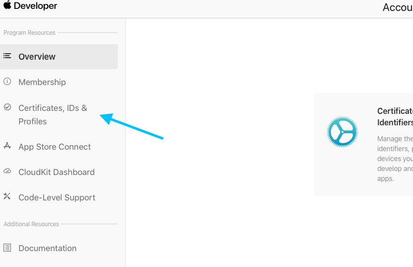
</details>

<details>
  <summary>In the Certificates, Identifiers & Profiles page go to Identifiers.</summary><br/>
    
  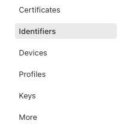
</details>

<details>
  <summary>In the list of your App IDs select the App that you want to edit.</summary><br/>
    
  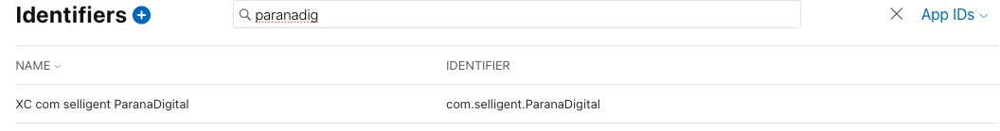
</details>

<details>
  <summary>In the list of capabilities enable Push Notifications.</summary><br/>
    
  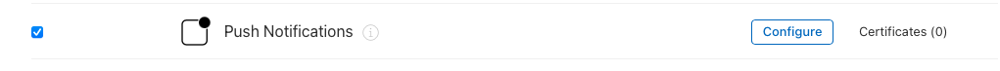
</details>

<details>
  <summary>In this screen you can also note the Bundle ID and Team ID associated to your App as you will need to provide them to Selligent.</summary><br/>
    
  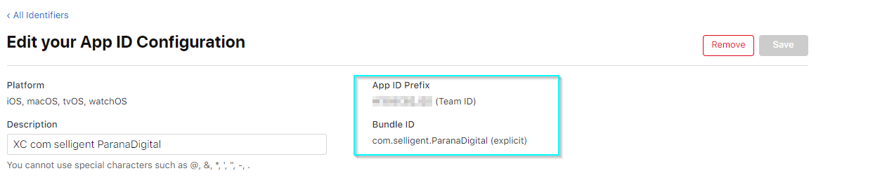
</details>

<a name="create_key"></a>
### Create a Key
<details>
  <summary>Back to the Certificates, Identifiers & Profiles page go to Keys and click on the + button to add a new Key.</summary><br/>
    
  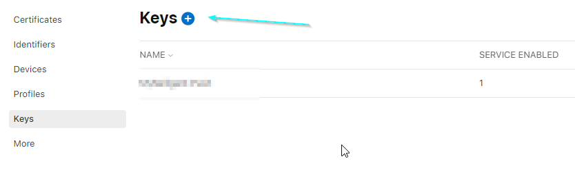
</details>

<details>
  <summary>Give a name to your Key, enable Apple Push Notifications service (APNS) and click on "continue" and then "register" in the next screen.</summary><br/>
    
  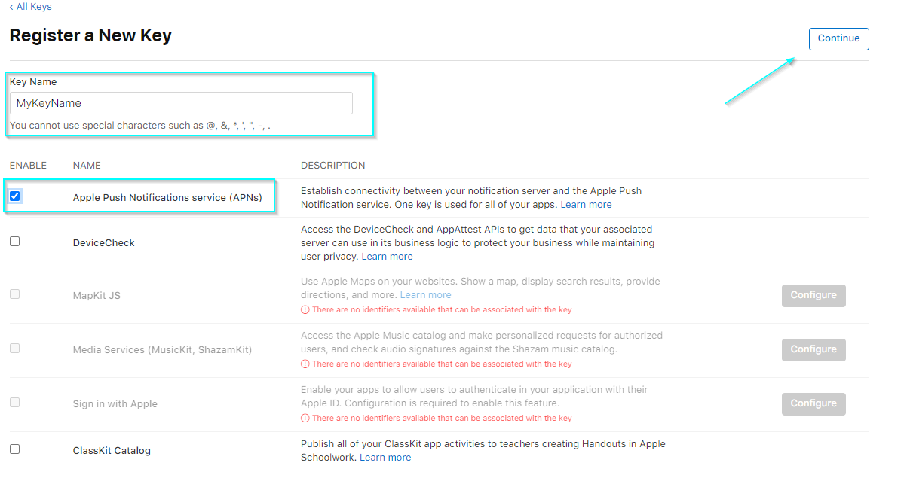
  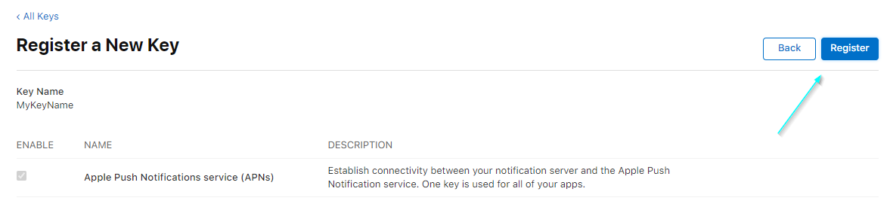
</details>

<details>
  <summary>In the next screen, carefully read the warning,  note down the Key ID and download it (you can only download the Key once!).</summary><br/>
    
  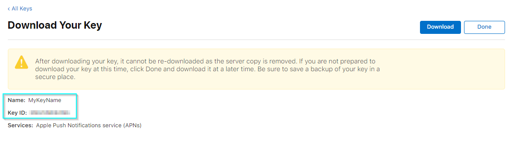
</details>

To use Selligent Push services you will need to provide to us:
- the downloaded **.p8** file
- the **Key ID**
- your **Team ID**
- the **Bundle ID** of the App

<a name="include_sdk"></a>
## Include the SDK in your target
<a name="import_library"></a>
### Import the library
<details>
  <summary>Right click (CTRL + Left click) on your App target and select "Add Files to YOURTARGET".</summary><br/>
    
  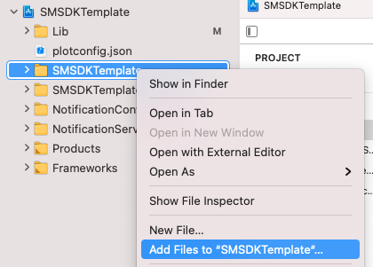
</details>

<details>
  <summary>Select the lib folder (the main folder containing the header and the lib files). Depending on your project, check the option "Copy items if needed" and select the "Create groups" option.</summary><br/>
    
  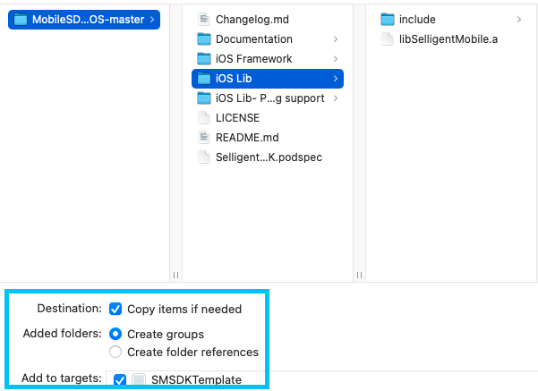
</details>

<details>
  <summary>Make sure the library has been added to your target and that its status is "Required".</summary><br/>
    
  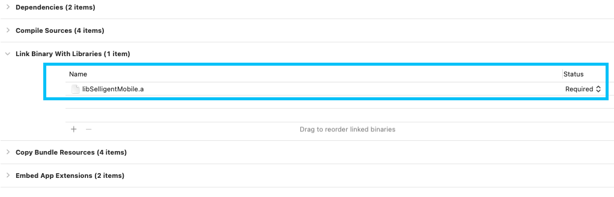
</details>

<details>
  <summary>Then, go to the "Build Settings" of your App target, search for "Other Linker Flags" property and set the value to "–ObjC".</summary><br/>
    
  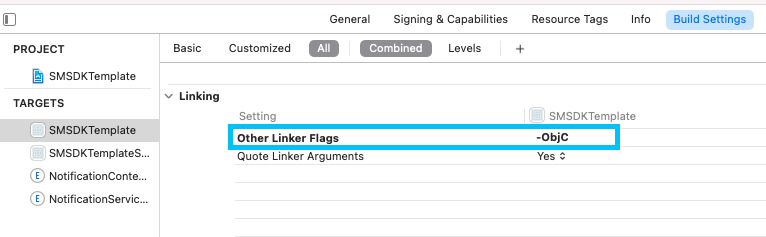
</details>

> For Objective-C Apps, import `SMHelper.h` where needed, for Swift Apps refer to [Note for Swift projects](#note_for_swift)

<a name="install_sdk"></a>
### Install the SDK as a framework
Since version 2.6, the SDK is also available on github as a **.xcframework**.

You can either install it via cocoapod ([learn more](../README.md)) or as a stand alone by downloading and dropping the .xcframework package into your project (don't forget to add it into the App and the Notification Extensions where you will use the framework).

To use it, you will need to import the following where needed:

**Swift**
```swift
import SelligentMobileSDK
```

**Objective-C**
```objective-c
#import <SelligentMobileSDK/SelligentMobileSDK.h>;
// Or
@import SelligentMobileSDK;
```

<a name="note_for_swift"></a>
### Note for Swift projects
For a Swift App, you need to create a **Bridging-Header** file.
> Unless you are using the framework, in which case you can import it as a module (as shown above).

To create it automatically, add an Objective-C file to your Swift App and Xcode will offer you the possibility to create this header file.

<details>
  <summary>If you accept, Xcode creates the header file along with the file you were creating, and names it by your product module name followed by "-Bridging-Header.h".</summary><br/>
    
  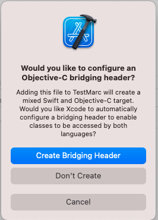
</details>

You can also create it manually by adding a header file to your project, named `[MyProjectName]-Bridging-Header.h`. In your project build settings, find `Swift Compiler – Code Generation`, and next to `Objective-C Bridging Header` add the path to your bridging header file from the project's root folder. So, it could be `MyProject/MyProject-Bridging-Header.h` or simply `MyProject-Bridging-Header.h` if the file is in the project root folder.

In both cases, you will need to import a header file to expose the SDK APIs to Swift. Do it by adding this line:

```objective-c
// Static Library
#import "SMHelper.h"

// Framework
#import <SelligentMobileSDK/SelligentMobileSDK.h>
```

More information about this configuration in [Apple documentation](https://developer.apple.com/library/ios/documentation/Swift/Conceptual/BuildingCocoaApps/MixandMatch.html).

<a name="deep_linking"></a>
### Deep Linking
<a name="plist_entries"></a>
### Add entries to your App .plist file
You should configure correctly the **plist** of your App to allow this to work, by registering a custom URL scheme:
```xml
<key>CFBundleURLTypes</key>
<array>
  <dict>
    <key>CFBundleURLName</key>
    <string>yourappbundle</string>
    <key>CFBundleURLSchemes</key>
    <array>
      <string>yourscheme</string>
    </array>
  </dict>
</array> 
```

You will also have to add `LSApplicationQueriesSchemes` Key, with your scheme as string, to allow your App to open the URL:
```xml
<key>LSApplicationQueriesSchemes</key>
<array>
  <string>appscheme</string>
</array> 
```

By doing this, you will be able to parse the URL and process it like you want in openURL.

**Swift**
```swift
// When the SDK calls for example:
let url = URL(string: "yourscheme://anypage")!
UIApplication.shared.openURL(url)

// What you need to implement in your AppDelegate:
func application(_ app: UIApplication, open url: URL, options: [UIApplication.OpenURLOptionsKey : Any] = [:]) -> Bool {
    // Here you will be able to parse your url 
    print(url.absoluteString)
    return true
} 
```

**Objective-C**
```objective-c
// When the SDK calls for example:
NSURL *url = [NSURL URLWithString:@"yourscheme://anypage"];
[[UIApplication sharedApplication] openURL:url];

// What you need to implement in your AppDelegate:
- (BOOL) application:(UIApplication *)app openURL:(NSURL *)url options:(NSDictionary<UIApplicationOpenURLOptionsKey,id> *)options {
    // Here you will be able to parse your url
    NSLog(@"%@", [url absoluteString]);
    return true;
}
```
If all is correctly set then when the user receives a Push and clicks it, the App will open, and will trigger the `appscheme://anypage`.

<a name="universal_links"></a>
### Universal Links
By default, universal links in a button from a Push/IAM/IAC will open the default browser, to avoid this and catch them on the App and apply any logic you want, you will need to create a class that implements the `SMManagerUniversalLinksDelegate` and provide it to the SDK.

> **Do not set this delegate when starting the SDK from  `Notification Extensions`.**

> The delegate will only get triggered from `deeplink` button types defined in Selligent Marketing Cloud UI, whose URL scheme is `http` or `https`.

> When talking about Push notification buttons (and if the `didReceiveNotificationResponse` was implemented inside the `Notification Content Extension`), the universal link delegate won't be triggered in that case and the universal link execution will follow the standard [Apple process](https://developer.apple.com/documentation/xcode/supporting-universal-links-in-your-app) (like if it was clicked from an external website).

**Swift**
```swift
// Provide an instance of a class implementing SMManagerUniversalLinksDelegate to the SDK (you can do that for example at launch time)
SMManager.sharedInstance().universalLinksDelegate(AppUniversalLinksDelegateExample())

// Your class will look like
import Foundation

class AppUniversalLinksDelegateExample: NSObject, SMManagerUniversalLinksDelegate {
    func executeLinkAction(_ url: URL) {
        // Your code to handle the universal link being executed
        print(url)
    }
}
```

**Objective-C**
```objective-c
// Provide an instance of a class implementing SMManagerUniversalLinksDelegate to the SDK (you can do that for example at launch time)
[[SMManager sharedInstance] universalLinksDelegate:[AppUniversalLinksDelegateExample new]];

// Your class will look like
// AppUniversalLinksDelegateExample.h
#import "SMHelper.h"

@interface AppUniversalLinksDelegateExample : NSObject <SMManagerUniversalLinksDelegate>
@end

// AppUniversalLinksDelegateExample.m
#import "AppUniversalLinksDelegateExample.h"

@implementation AppUniversalLinksDelegateExample

- (void) executeLinkAction:(NSURL *)url {
    // Your code to handle the universal link being executed
    NSLog(@"%@", url);
}

@end
```

<a name="external_framework"></a>
### External framework
If you consider using the Geolocation module of the library and you have the correct version of the Selligent SDK, you will need to embed **PlotProjects.framework** besides the Selligent library in your App.
> Since SDK v2.1, minimum supported version of PlotProjects is v3.2.0.

You will also need to configure it with the **plotconfig.json** file in the root folder of your project ([learn more](#geolocation)).

<a name="geolocation_permission"></a>
### Permission for geolocation
Add the `NSLocationWhenInUseUsageDescription` and the `NSLocationAlwaysAndWhenInUseUsageDescription` Keys in your **Info.plist** file (Xcode displays these Keys as `Privacy - Location When In Use Usage Description` and `Privacy - Location Always and When In Use Usage Description` in the editor).

If your App supports iOS 10 and earlier, add the `NSLocationAlwaysUsageDescription` Key to your Info.plist file (Xcode displays this Key as `Privacy - Location Always Usage Description` in the editor).

Pay attention to the description that you will provide to those Keys, as that is what will be displayed to the user when the permissions are asked.

<a name="starting_sdk"></a>
## Starting the SDK
To start the library, please follow the steps below (will mainly happen in your `UIApplication`'s delegate).
The following must be done in:

**Swift**
```swift
func application(_ application: UIApplication, didFinishLaunchingWithOptions launchOptions: [UIApplication.LaunchOptionsKey: Any]?) -> Bool
```

**Objective-C**
```objective-c
- (BOOL) application:(UIApplication *)application didFinishLaunchingWithOptions:(NSDictionary *)launchOptions
```

* Create an instance of `SMManagerSetting` with the **url**, **clientID** and **privateKey** provided by Selligent.
* Set the following optional properties according to your needs:
  
  | Property | Description |
  | --------- | --------- |
  | `shouldClearBadge` | If you want the SDK to manage badge clearance. |
  | `shouldDisplayRemoteNotification` | If you want to prevent the display of Push Notifications by the SDK and manage it in your App ([learn more](#notification_helper_methods)). |
  | `shouldAddInAppMessageFromPushToInAppMessageList` | If you want to add the InApp Message associated to a Push Notification to the InApp Message list ([learn more](#display_iam)). |
  | `clearCacheIntervalValue` | Define the interval value to clear the SDK internal cache (this setting is only used for messages that do not have an expiration date – otherwise expiration date of the message will be taken into account for lifetime of the message in cache). |
  | `appGroupId` | Provide the App GroupId to the SDK (`group.yourGroupName`) that you will have previously configured in your Apple Developer Portal. This is mandatory when you use one Notification extension (service and/or content) ([learn more](#notification_extensions)). |
  | `remoteMessageDisplayType` | This value defines the behaviour that the SDK will adopt when a remote-notification is received when in Foreground ([learn more](MobileSDK%20Reference/Classes/SMManagerSetting.md#/api/name/remoteMessageDisplayType)). |
  
* Optionally initialise and configure InApp Messages.
* Optionally configure location services (may not be available depending on your SDK version).

**Swift**
```swift
let url = "YourProvidedURL";
let clientID = "YourClientID";
let privateKey = "YourPrivateKey";

// Create the SMManagerSetting instance
let settings: SMManagerSetting = SMManagerSetting(url: url, clientID: clientID, privateKey: privateKey)

// Optional - Default value is true
settings.shouldClearBadge = true
settings.shouldDisplayRemoteNotification = true
settings.shouldAddInAppMessageFromPushToInAppMessageList = false

// Optional - Default value is .auto
settings.clearCacheIntervalValue = .auto

// Only mandatory when you want to use a Notification extension (service or/and content)
settings.appGroupId = "group.yourGroupName";

// Optional - Initialize InApp Messages settings
let settingIAM = SMManagerSettingIAM.setting(with: .smia_RefreshType_Daily)
settings.configureInAppMessageService(withSetting: settingIAM)

// Optional - Initialize location services
settings.configureLocationService()

// Optional - Define the SDK behaviour when receiving push notifications in foreground
// Make sure you have read this setting's documentation from SMManagerSetting reference, before using it
// settings.remoteMessageDisplayType = .notification
```

**Objective-C**
```objective-c
NSString *url = @"YourProvidedURL";
NSString *clientID = @"YourClientID";
NSString *privatKey = @"YourPrivateKey";

// Create the SMManagerSetting instance
SMManagerSetting *settings = [SMManagerSetting settingWithUrl:url ClientID:clientID PrivateKey:privatKey];

// Optional - Default value is true
settings.shouldClearBadge = true;
settings.shouldDisplayRemoteNotification = true;
settings.shouldAddInAppMessageFromPushToInAppMessageList = false;

// Optional - Default value is kSMClearCache_Auto
settings.clearCacheIntervalValue = kSMClearCache_Auto;
// Only mandatory when you want to use a Notification extension (Services or/and Content)
settings.appGroupId = @"group.yourGroupName";

// Initialize InApp Messages settings - other constructors exist (cf. documentation)
SMManagerSettingIAM *iamSetting = [SMManagerSettingIAM settingWithRefreshType:kSMIA_RefreshType_Daily];
[settings configureInAppMessageServiceWithSetting:iamSetting];

// Optional - Initialize location services
[settings configureLocationService];

// Optional - Define the SDK behaviour when receiving push notifications in foreground
// Make sure you have read this setting's documentation from SMManagerSetting reference, before using it
// settings.remoteMessageDisplayType = kSMRemoteMessageDisplayType_Notification;
```

**Mandatory**: call the `start` API of the SDK right afterwards.

**Swift**
```swift
// Starting the SDK
SMManager.sharedInstance().start(launchOptions: launchOptions, setting: settings)
```

**Objective-C**
```objective-c
// Starting the SDK
[[SMManager sharedInstance] startWithLaunchOptions:launchOptions Setting:settings];
```

<a name="push_notifications"></a>
### Push Notifications
<a name="register_for_push"></a>
### Register for Push Notifications
Starting the library won't register for Push Notifications. You will need to call:

**Swift**
```swift
SMManager.sharedInstance().registerForRemoteNotification()
```

**Objective-C**
```objective-c
[[SMManager sharedInstance] registerForRemoteNotification];
```

This can be called whenever you need to do it in your App.
> If you plan to trigger this when a certain page or criteria is met, do take into account to trigger it for users that might have already given the permission in a previous version of your App without the Selligent SDK.<br>
> Not doing so, would make it impossible for Selligent to receive the necessary **device push token**, to be used when sending Push Notifications.

<details>
  <summary>You can then customize the way you inform the user before the display of iOS alert which will let the user allow Push Notifications for the App on the device (the iOS alert is displayed only once).</summary><br/>
    
  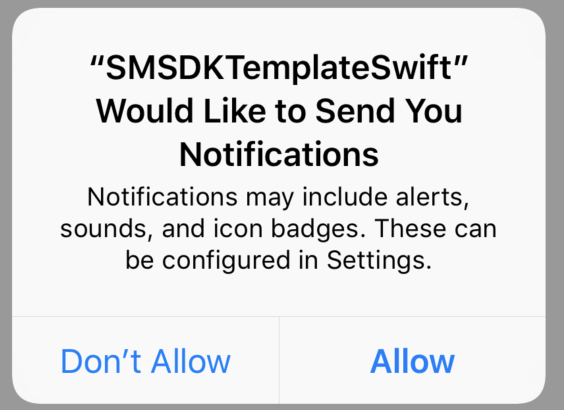
</details>

<a name="register_for_provisional_push"></a>
### Register for Provisional Push Notifications
> This option is only available for iOS 12+.

You can also decide to first ask for the Provisional push authorization (which will provide a valid push token but will not show any prompt to the user) if you want to contact users that did not decide about the Push permission yet (you can call `registerForRemoteNotification` later and it will still display the push permission prompt to the user).

**Swift**
```swift
SMManager.sharedInstance().registerForProvisionalRemoteNotification()
```

**Objective-C**
```objective-c
[[SMManager sharedInstance] registerForProvisionalRemoteNotification];
```
> If you want to segmentate your campaigns based on the type of authorization (provisional/normal), you can contact your Selligent TC or our support team to make the necessary configurations in the platform, to have it available.

<a name="provide_device_token"></a>
### Provide the Device token to the SDK
If the user has accepted to receive Push Notifications, the device will be given a **device push token** by Apple, that you must provide to the Selligent platform. To do that you must implement:

**Swift**
```swift
func application(_ application: UIApplication, didRegisterForRemoteNotificationsWithDeviceToken deviceToken: Data) {
    SMManager.sharedInstance().didRegisterForRemoteNotifications(withDeviceToken: deviceToken)
}
```

**Objective-C**
```objective-c
- (void) application:(UIApplication *)application didRegisterForRemoteNotificationsWithDeviceToken:(NSData *)deviceToken {
    [[SMManager sharedInstance] didRegisterForRemoteNotificationsWithDeviceToken:deviceToken];
}
```

<a name="provide_information_sdk"></a>
### Provide Push Notifications status to the SDK
> Optional, the SDK is able to get this information by itself.<br>
> **Since iOS 10, didRegisterUserNotificationSettings has been deprecated.**

**Swift**
```swift
func application(_ application: UIApplication, didRegister notificationSettings: UIUserNotificationSettings) {
    SMManager.sharedInstance().didRegister(notificationSettings)
}

func application(_ application: UIApplication, didFailToRegisterForRemoteNotificationsWithError error: Error) {
    SMManager.sharedInstance().didFailToRegisterForRemoteNotificationsWithError(error)
}
```

**Objective-C**
```objective-c
- (void) application:(UIApplication *)application didRegisterUserNotificationSettings:(UIUserNotificationSettings *)notificationSettings {
    [[SMManager sharedInstance] didRegisterUserNotificationSettings:notificationSettings];
}

- (void) application:(UIApplication *)application didFailToRegisterForRemoteNotificationsWithError:(NSError *)error {
    [[SMManager sharedInstance] didFailToRegisterForRemoteNotificationsWithError:error];
}
```

<a name="disable_selligent_push"></a>
### Disable Selligent Push Notifications
By default, Selligent Push Notifications are enabled and, if the device is correctly registered to iOS, then you don't have anything else to do.

But if you want to disable (or enable) Selligent Pushes only (and still be able to receive other third party pushes), you have the possibility to do so by using:

**Swift**
```swift
SMManager.sharedInstance().enableRemoteNotification()
SMManager.sharedInstance().disableRemoteNotification()
```

**Objective-C**
```objective-c
[[SMManager sharedInstance] enableRemoteNotification];
[[SMManager sharedInstance] disableRemoteNotification];
```

Keep in mind that if, at device level, the Push Notifications are not registered and enabled then `enableRemoteNotification` won't be enough to receive Selligent Pushes.

<a name="displaying_push"></a>
### Listening and displaying the Push Notifications
<a name="builds_against_ios10"></a>
### App that builds against iOS 10+
Besides the implementation described in [App that doesn't build against iOS 10+](#doesnt_build_against_ios10) (in case you need to support iOS 8 and 9), you will also need to implement a few methods from `UNUserNotificationCenterDelegate`.

**Swift**
```swift
class AppDelegate: UIResponder, UIApplicationDelegate, UNUserNotificationCenterDelegate {
    func application(_ application: UIApplication, didFinishLaunchingWithOptions launchOptions: [UIApplicationLaunchOptionsKey : Any]?) -> Bool {
    // Other code
    UNUserNotificationCenter.current().delegate = self
    // Start the SDK below
}

func userNotificationCenter(_ center: UNUserNotificationCenter, willPresent notification: UNNotification, withCompletionHandler completionHandler: @escaping(UNNotificationPresentationOptions) -> Void) {
    // See SMManagerSetting reference for more information about how the SDK handles the display of pushs in foreground
    SMManager.sharedInstance().willPresent(response, withCompletionHandler: completionHandler)
    // OR
    // SMManager.sharedInstance().willPresent(notification)
    // completionHandler(.alert) // or any UNNotificationPresentationOptions
    // In this case the App will be in charge to call completionHandler
}

func userNotificationCenter(_ center: UNUserNotificationCenter, didReceive response: UNNotificationResponse, withCompletionHandler completionHandler: @escaping() -> Void) {
    SMManager.sharedInstance().didReceive(response, withCompletionHandler: completionHandler)
    
    // OR
    // SMManager.sharedInstance().didReceive(response)
    // completionHandler()
    // In this case the App will be in charge to call completionHandler
}
```

**Objective-C**
```objective-c
// AppDelegate.h
#import <UserNotifications/UserNotifications.h>

@interface AppDelegate: UIResponder<UIApplicationDelegate, UNUserNotificationCenterDelegate>

// AppDelegate.m
- (BOOL) application:(UIApplication *)application didFinishLaunchingWithOptions:(NSDictionary *)launchOptions {
    // Other code
    UNUserNotificationCenter *center = [UNUserNotificationCenter currentNotificationCenter];
    center.delegate = self;
    // Start the SDK below
}

- (void) userNotificationCenter:(UNUserNotificationCenter *)center willPresentNotification:(UNNotification *)notification withCompletionHandler:(void(^)(UNNotificationPresentationOptions))completionHandler {
    // See SMManagerSetting reference for more information about how the SDK handles the display of pushs in foreground
    [[SMManager sharedInstance] willPresentNotification:notification withCompletionHandler:completionHandler];
    
    // OR 
    // [[SMManager sharedInstance] willPresentNotification:notification];
    // completionHandler(UNNotificationPresentationOptionAlert); // or any UNNotificationPresentationOptions
    // In this case the App will be in charge to call completionHandler
}

- (void) userNotificationCenter:(UNUserNotificationCenter *)center didReceiveNotificationResponse:(UNNotificationResponse *)response withCompletionHandler:(void(^)(void))completionHandler {
    [[SMManager sharedInstance] didReceiveNotificationResponse:response withCompletionHandler:completionHandler];
    
    // OR 
    // [[SMManager sharedInstance] didReceiveNotificationResponse:response];
    // completionHandler();
    // In this case the App will be in charge to call completionHandler:
}
```

<a name="doesnt_build_against_ios10"></a>
### App that doesn't build against iOS 10+
Implement the methods described in [SMManager(RemoteNotification)](MobileSDK%20Reference/Categories/SMManager%2BRemoteNotification.md) in your `UIApplication`'s delegate.

**Swift**
```swift
func application(_ application: UIApplication, didReceiveRemoteNotification userInfo: [AnyHashable : Any]) {
    // See SMManagerSetting reference for more information about how the SDK handles the display of pushs in foreground
    SMManager.sharedInstance().didReceiveRemoteNotification(userInfo)
}
```

**Objective-C**
```objective-c
- (void) application:(UIApplication *)application didReceiveRemoteNotification:(NSDictionary *)userInfo {
    // See SMManagerSetting reference for more information about how the SDK handles the display of pushs in foreground
    [[SMManager sharedInstance] didReceiveRemoteNotification:userInfo];
}
```

> You can also implement specific delegates when your App supports background modes ([learn more](MobileSDK%20Reference/Categories/SMManager+SilentPush.md)).

<a name="notification_helper_methods"></a>
### Helper methods
There are some useful methods which allow you to manage when you want to display the Push Notification in your own way, when `SMManagerSetting shouldDisplayRemoteNotification` is set to `false` or when working with different `remoteMessageDisplayType` values (and the App is in foreground).

**Swift**
```swift
// Retrieves the SMNotificationMessage object from the given userInfo Dictionary, if any
SMManager.sharedInstance().retrieveNotificationMessage(userInfo);

// Given a valid SMNotificationMessage, the SDK will send the corresponding Opened event to the Selligent platform
SMManager.sharedInstance().setNotificationMessageAsSeen(notificationMessage);

// Given a valid SMLink and SMNotificationMessage, the SDK will send the corresponding Clicked event to the Selligent platform
SMManager.sharedInstance().setLinkAsClicked(link, from: notificationMessage);

// Display last received Push Notification
SMManager.sharedInstance().displayLastReceivedRemotePushNotification()

// Retrieve last Push Notification (NSDictionary with id and title)
SMManager.sharedInstance().retrieveLastRemotePushNotification()
```

**Objective-C**
```objective-c
// Retrieves the SMNotificationMessage object from the given userInfo Dictionary, if any
[[SMManager sharedInstance] retrieveNotificationMessage:userInfo];

// Given a valid SMNotificationMessage, the SDK will send the corresponding Opened event to the Selligent platform
[[SMManager sharedInstance] setNotificationMessageAsSeen:notificationMessage];

// Given a valid SMLink and SMNotificationMessage, the SDK will send the corresponding Clicked event to the Selligent platform
[[SMManager sharedInstance] setLinkAsClicked:link fromMessage:notificationMessage];

// Display last received Push Notification
[[SMManager sharedInstance] displayLastReceivedRemotePushNotification];

// Retrieve last Push Notification (NSDictionary with id and title)
 [[SMManager sharedInstance] retrieveLastRemotePushNotification];
```

<a name="push_broadcasts"></a>
### Broadcasts

| Name | Type | Description |
| --------- | --------- | --------- |
| `kSMNotification_Event_ButtonClicked` | `NSNotification` name | It is broadcasted when the user interacts with a Remote Notification. Useful to retrieve user's actions on a received Remote Notification. |
| `kSMNotification_Event_WillDisplayNotification` | `NSNotification` name | It is broadcasted shortly before displaying a Remote Notification. Primary Application may use this notification to pause any ongoing work before the Remote Notification is displayed. This notification-name is also triggered even if you disable `shouldDisplayRemoteNotification` ([learn more](MobileSDK%20Reference/Classes/SMManagerSetting.md)). |
| `kSMNotification_Event_WillDismissNotification` | `NSNotification` name | It is broadcasted shortly before dismissing the current Remote Notification. Primary application may use this notification to resume any paused work (see `kSMNotification_Event_WillDisplayNotification`). |
| `kSMNotification_Event_DidReceiveRemoteNotification` | `NSNotification` name | It is broadcasted shortly after receiving a Remote Notification. Primary Application may use this notification to decide when to display any Remote Notification. |
| `kSMNotification_Data_ButtonData` | `NSString` Key | Use this Key to retrieve the object [SMNotificationButtonData](MobileSDK%20Reference/Classes/SMNotificationButtonData.md), from the NSNotification-name `kSMNotification_Event_ButtonClicked`. |
| `kSMNotification_Data_RemoteNotification` | `NSString` Key | Use this Key to retrieve an `NSDictionary` instance with the Push ID and name, from the NSNotification-name `kSMNotification_Event_DidReceiveRemoteNotification`. |

Examples can be found [here](#broadcasts_examples).

<a name="inapp_messages"></a>
## InApp Messages
<a name="enable_iam"></a>
### Enable IAM
If InApp Messages (we will refer to them with IAM) are correctly configured ([learn more](#starting_sdk)), you will need to enable them once, wherever you want in your App, by calling:

**Swift**
```swift
SMManager.sharedInstance().enable(inAppMessage: true)
```

**Objective-C**
```objective-c
[[SMManager sharedInstance] enableInAppMessage:true];
```

> It is also possible to fetch IAM in background mode ([learn more](MobileSDK%20Reference/Classes/SMManagerSettingIAM.md)).

<a name="display_iam"></a>
### Display IAM
To retrieve the IAM delivered to the device you must listen to `kSMNotification_Event_DidReceiveInAppMessage` ([learn more](#iam_broadcasts)).

### With SDK helper functions
This will provide you an `NSArray` of `NSDictionary` containing 2 properties: **id** and **title**, for each IAM available for the device.

**Swift**
```swift
NotificationCenter.default.addObserver(self, selector: #selector(didReceiveInAppMessage(_:)), name: NSNotification.Name(rawValue: kSMNotification_Event_DidReceiveInAppMessage), object: nil)

@objc func didReceiveInAppMessage(_ notif: Notification) {
    let dictIAM = notif.userInfo
    let array: Array = dictIAM![kSMNotification_Data_InAppMessage] as! Array<AnyObject>
}
```

**Objective-C**
```objective-c
[[NSNotificationCenter defaultCenter] addObserver:self selector:@selector(didReceiveInAppMessage:) name:kSMNotification_Event_DidReceiveInAppMessage object:nil];

- (void) didReceiveInAppMessage:(NSNotification *)notif {
    NSDictionary *dictIAM = [notif userInfo];
    NSMutableArray *arrayIAM = [dictIAM objectForKey:kSMNotification_Data_InAppMessage];
}
```

Once your IAM is retrieved you can for example create an inbox page and when the user clicks on the IAM you can tell the SDK to display it calling:

**Swift**
```swift
SMManager.sharedInstance().displayNotificationID("notificationID")
```

**Objective-C**
```objective-c
[[SMManager sharedInstance] displayNotificationID:@"notificationID"];
```

### With your own layout
Since SDK v.2.5, once notified that new IAM are available, you can access all their properties from App side (so you can display them with your own UI), you can also request for the full list of `not-expired` IAM to the SDK. This will give you more flexibility when displaying them.

**Swift**
```swift
// This method will provide you an array of SMInAppMessage, all received and not expired IAM
let inAppMessages: [Any] = SMManager.sharedInstance().getInAppMessages()

if (inAppMessages.count > 0) {
    let message = inAppMessages.first as! SMInAppMessage
    // If an IAM has links associated to it, you can retrieve them with arrayIAMLinks on the SMInAppMessage object, you can then display the link the way you prefer,
    // and once the user has clicked the link you will have to do a call to executeLinkAction
    if let links = message.arrayIAMLinks {
        let link = links.first
        SMManager.sharedInstance().executeLinkAction(link as? SMLink, inAppMessage: message)
    }

    // When an IAM has been displayed to the user you will have to mandatory call
    // This will permit to the Selligent platform to set the adequate (open) event to the IAM
    SMManager.sharedInstance().setInAppMessageAsSeen(message)

    // If you wish to remove the flag of a message as seen you can do so (this won't change the event state at platform level)
    SMManager.sharedInstance().setInAppMessageAsUnseen(message)

    // This helper method that will allow you to set a message as deleted (in this case the message won't be provided to you anymore)
    SMManager.sharedInstance().setInAppMessageAsDeleted(message)
}
```

**Objective-C**
```objective-c
// This method will provide you an array of SMInAppMessage, all received and not expired IAM
NSArray *inAppMessages = [[SMManager sharedInstance] getInAppMessages];

if ([inAppMessages count] > 0) {
    SMInAppMessage *message = inAppMessages.firstObject;

    // If an IAM has links associated to it, you can retrieve them with arrayIAMLinks on the SMInAppMessage object, you can then display the link the way you prefer,
    // and once the user has clicked the link you will have to do a call to executeLinkAction
    if ([message.arrayIAMLinks count] > 0) {
        SMLink *link = message.arrayIAMLinks.firstObject;
        [[SMManager sharedInstance] executeLinkAction:link InAppMessage:message];
    }

    // When an IAM has been displayed to the user you will have to mandatory call
    // This will permit to the Selligent platform to set the adequate (open) event to the IAM
    [[SMManager sharedInstance] setInAppMessageAsSeen:message];

    // If you wish to remove the flag of a message as seen you can do so (this won't change the event state at platform level)
    [[SMManager sharedInstance] setInAppMessageAsUnseen:message];

    // This helper method that will allow you to set a message as deleted (in this case the message won't be provided to you anymore)
    [[SMManager sharedInstance] setInAppMessageAsDeleted:message];
}
```

<a name="wknavigationdelegate"></a>
### Implement WKNavigationDelegate
When an IAM of type URL/PAGE is displayed by the SDK in a webView, if you wish for example to process the clicked link inside the webView on the App side, the SDK gives you the ability to do so by having a class in your App that implements the `WKNavigationDelegate` and providing an instance of this class to the SDK.

> This is necessary if you want to have deep and universal links working from within this type of SDK IAM.

To achieve this, you can call the method `SMManagerSetting inAppMessageWKNavigationDelegate` and give the instance of the class that will be in charge of implementing the `WKNavigationDelegate` methods as parameter.

You will also need to call `SMManager removeViewController` whenever you wish to close the webView controller displayed by the SDK.

**Swift**
```swift
// Provide an instance of a class implementing WKNavigatonDelegate to the SDK (you can do that for example at launch time)
SMManager.sharedInstance().inAppMessageWKNavigationDelegate(AppWKNavigationDelegateExample())

// Your class will look like
import Foundation

class AppWKNavigationDelegateExample: NSObject, WKNavigationDelegate {
    func webView(_ webView: WKWebView, decidePolicyFor navigationAction: WKNavigationAction, decisionHandler: @escaping (WKNavigationActionPolicy) -> Void) {
        if navigationAction.navigationType == .linkActivated  {
            if let url = navigationAction.request.url,
            let host = url.host, host.hasPrefix("myDomain"),
            UIApplication.shared.canOpenURL(url) {
                // Logic here to show your App page
                // Remove SDK's webView controller
                SMManager.sharedInstance().removeViewController()
                decisionHandler(.cancel)
                return
            }
        }
        
        decisionHandler(.allow)
    }
 
    // The below functions are necessary to keep the SDK webview's navigation arrows working
    func webView(_ webView: WKWebView, didFail navigation: WKNavigation!, withError error: Error) {
        SMManager.sharedInstance().webView(webView, didFail: navigation, withError: error)
    }
 
    func webView(_ webView: WKWebView, didFinish navigation: WKNavigation!) {
        SMManager.sharedInstance().webView(webView, didFinish: navigation)
    }
        
    func webView(_ webView: WKWebView, didCommit navigation: WKNavigation!) {
        SMManager.sharedInstance().webView(webView, didCommit: navigation)
    }
}
```

**Objective-C**
```objective-c
// Provide an instance of a class implementing WKNavigatonDelegate to the SDK (you can do that for example at launch time)
[[SMManager sharedInstance] inAppMessageWKNavigationDelegate:[AppWKNavigationDelegateExample new]];

// Your class will look like
// AppWKNavigationDelegateExample.h
#import <WebKit/WebKit.h>
#import <Foundation/Foundation.h>

@interface AppWKNavigationDelegateExample: NSObject<WKNavigationDelegate>
@end

// AppWKNavigationDelegateExample.m
#import "AppWKNavigationDelegateExample.h"
#import "SMHelper.h"

@implementation AppWKNavigationDelegateExample

- (void)webView:(WKWebView *)webView decidePolicyForNavigationAction:(nonnull WKNavigationAction *)navigationAction decisionHandler:(nonnull void(^)(WKNavigationActionPolicy))decisionHandler {
    if (navigationAction.navigationType == WKNavigationTypeLinkActivated) {
        if (navigationAction.request.URL) {
            if (![navigationAction.request.URL.resourceSpecifier containsString:@"myDomain"]) {
                // Logic here to show your App page
                // Remove SDK's webView controller
                [[SMManager sharedInstance] removeViewController];
                decisionHandler(WKNavigationActionPolicyCancel);
                return;
            }
        }
    }
    
    decisionHandler(WKNavigationActionPolicyAllow);
}

// The below functions are necessary to keep the SDK webview's navigation arrows working
- (void) webView:(WKWebView *)webView didFailNavigation:(WKNavigation *)navigation withError:(NSError *)error {
    [[SMManager sharedInstance] webView:webView didFailNavigation: navigation withError: error];
}

- (void) webView:(WKWebView *)webView didFinishNavigation:(WKNavigation *)navigation {
    [[SMManager sharedInstance] webView:webView didFinishNavigation: navigation];
}

- (void) webView:(WKWebView *)webView didCommitNavigation:(WKNavigation *)navigation {
    [[SMManager sharedInstance] webView:webView didCommitNavigation: navigation];
}

@end
```

<a name="display_iam_from_push"></a>
### Display IAM linked to a Push Notification
When an IAM is available with the payload of a Push Notification, you can also decide to process its content and display it on App side.

To achieve this, you can call the method `inAppMessageDelegate` and give the instance of the class that will be in charge of implementing the `SMManagerInAppMessageDelegate ` methods as a parameter.

**Swift**
```swift
// Provide an instance of a class implementing SMManagerInAppMessageDelegate to the SDK (you can do that for example at launch time)
SMManager.sharedInstance().inAppMessageDelegate(AppInAppMessageDelegateExample())

// Your class will look like
import Foundation
    
class AppInAppMessageDelegateExample: NSObject,SMManagerInAppMessageDelegate {
    // This will be called when the IAM (from a Push Notification) would be about to be displayed
    func display(_ inAppMessage: SMInAppMessage) {
        print(inAppMessage.title!)
        print(inAppMessage.body!)
        //print(inAppMessage.arrayIAMLinks!)
    }
}
```

**Objective-C**
```objective-c
// Provide an instance of a class implementing SMManagerInAppMessageDelegate to the SDK (you can do that for example at launch time)
[[SMManager sharedInstance] inAppMessageDelegate:[AppInAppMessageDelegateExample new]];

// Your class will look like
// AppInAppMessageDelegateExample.h
#import <Foundation/Foundation.h>
#import "SMHelper.h"

@interface AppInAppMessageDelegateExample: NSObject<SMManagerInAppMessageDelegate>
@end

// AppInAppMessageDelegateExample.m
#import "AppInAppMessageDelegateExample.h"
#import "SMHelper.h"

@implementation AppInAppMessageDelegateExample

// This will be called when the IAM (from a Push Notification) would be about to be displayed
- (void) displayInAppMessage:(SMInAppMessage *)inAppMessage {
    NSLog(@"title :%@", inAppMessage.title);
    NSLog(@"content :%@", inAppMessage.body);
    //NSLog(@"links :%@", inAppMessage.arrayIAMLinks);
}

@end
```

<a name="iam_broadcasts"></a>
### Broadcasts

| Name | Type | Description |
| --------- | --------- | --------- |
| `kSMNotification_Event_DidReceiveInAppMessage ` | `NSNotification` name | It is broadcasted shortly after receiving an IAM. Primary application may use this notification to manage the received IAM. |
| `kSMNotification_Data_InAppMessage ` | `NSString` Key | Use this Key to retrieve an `NSArray` instance with an `NSDictionary` of `SMNotificationMessage` with title and id as properties, from the NSNotification-name `kSMNotification_Event_DidReceiveInAppMessage`. |

Examples can be found [here](#broadcasts_examples).

<a name="geolocation"></a>
## Geolocation
Geolocation is managed through a 3rd party framework: `PlotProjects.framework`. To fully use this feature, you will have to download a **specific version of the SDK**, contact Selligent support for more information and embed the `PlotProjects.framework` in your App.
> Since SDK v2.1, minimum supported version of PlotProjects is v3.2.0).

Beside this, PlotProjects framework needs the presence of a config file `plotconfig.json` ([learn more](https://www.plotprojects.com/documentation/#ConfigurationFile)) at the root of your project. 
The content of this file will look like:
```json
{
    "publicToken": "REPLACE_ME",
    "enableOnFirstRun": true,
    "maxRegionsMonitored": 10,
    "automaticallyAskLocationPermission": true
}
```

| Property | Description |
| --------- | --------- |
| `publicToken` | Will be the token provided for you to be able to use PlotProjects framework. |
| `enableOnFirstRun` | Will allow you to enable PlotProjects framework automatically if value is set to true, otherwise you will need to call `SMManager enableGeoLocation`. |
| `maxRegionsMonitored` | Is the maximum regions monitored by PlotProjects. The value of this property should be an integer between 5 and 20. This allows to keep some regions in case you want to monitor regions with another tool or by yourself. Keep in mind that the maximum regions that iOS allows to monitor is 20. |
| `automaticallyAskLocationPermission` | If set to true and your plist file is correctly configured ([learn more](#geolocation_permission)), then iOS opt-in dialog for geolocation will be displayed when the module is enabled for the first time. If set to false, you will be able to ask user opt-in whenever you want. Try considering this [best practice](https://www.plotprojects.com/blog/how-to-convince-your-app-users-to-opt-in-for-location-permissions-on-ios-13/) if you desire to do it this way. |

Whenever you decide to enable PlotProjects framework, another method exists which allows you to disable it:

**Swift**
```swift
SMManager.sharedInstance().disableGeoLocation()
```

**Objective-C**
```objective-c
[[SMManager sharedInstance] disableGeoLocation];
```

Once your App is correctly configured, you will be able to define your campaigns in PlotProjects dashboard.

<a name="events"></a>
## Events
* Sending any set of data to the backend can be done with `SMManager sendSMEvent`.
* A helper method `sendDeviceInfo` allows you to send a specific set of device information.

This method takes as a parameter a `SMDeviceInfos` object. This object contains for the moment one unique property: `externalId`.

**Swift**
```swift
let deviceInfos = SMDeviceInfos(externalId: "your CRM unique ID")
SMManager.sharedInstance().sendDeviceInfo(deviceInfos)
```

**Objective-C**
```objective-c
SMDeviceInfos *deviceInfos = [SMDeviceInfos deviceInfosWithExternalId:@"your CRM unique ID"];
[[SMManager sharedInstance] sendDeviceInfo:deviceInfos];
```
* Default events are available for you to be used. They all inherit from `SMEvent` and are configurable through their constructors:
    * `SMEventUserLogin`
    * `SMEventUserLogout`
    * `SMEventUserRegistration`
    * `SMEventUserUnregistration`

* `shouldCache` property on events: if the event fails to be delivered to our backend, then by default it is cached into an internal queue. After a while, the library will automatically try to send it again. Should you want to prevent this behaviour, feel free to set this property to `false`. By default, it is set to `true`.
* You can also initialize a success block and/or a failure block that will be triggered after an event is sent to the services.

<a name="events_register_unregister"></a>
### Registration / Unregistration
Three possible constructors:
```objective-c
+(instancetype)eventWithEmail:(NSString *)mail
+(instancetype)eventWithEmail:(NSString *)mail Dictionary:(NSDictionary<NSString *,NSString *> *)dict
+(instancetype)eventWithDictionary:(NSDictionary<NSString *,NSString *> *)dict
```

| Property | Description |
| --------- | --------- |
| `mail` | The e-mail of the user as an `NSString`. |
| `dict` | An `NSDictionary` containing a `NSString` as Key and a `NSString` as Data, for additional user data you want to provide to Selligent. |

### SMUserEventRegistration
This object is used to send a **register** event to the server with the e-mail of the user, potential data and a callback, with the purpose of linking the device to an user.

You can use an alternate key/value field to search for the user, in the `NSDictionary`.
> This event will create a new user in your Selligent database, if none was found.

**Swift**
```swift
let event = SMEventUserRegistration.event(withEmail: "usermail@mail.com", dictionary: ["key": "value"])

// Optional
event.shouldCache = true // Not necessary as it is the default value
event.applyBlockSuccess({ (success) -> Void in
    print("success")
}){ (failure) -> Void in
    print("failure")
}

SMManager.sharedInstance().send(event)
```

**Objective-C**
```objective-c
SMEventUserRegistration *event = [SMEventUserRegistration eventWithEmail:@"usermail@mail.com" Dictionary:@{@"key":@"value"}];

// Optional
event.shouldCache = true; // Not necessary as it is the default value
[event applyBlockSuccess:^(SMSuccess *success) {
    NSLog(@"success");
} BlockFailure:^(SMFailure *failure) {
    NSLog(@"failure");
}];

[[SMManager sharedInstance] sendSMEvent:event];
```

### SMEventUserUnregistration
This object is used to send an **unregister** event to the server with the e-mail of the user, potential data, and a callback.
> This event is not unlinking the user from the device (automatically), at the moment.

**Swift**
```swift
let event = SMEventUserUnregistration.event(withEmail: "usermail@mail.com", dictionary: ["key": "value"])

// Optional
event.shouldCache = true // Not necessary as it is the default value
event.applyBlockSuccess({ (success) -> Void in
    print("success")
}){ (failure) -> Void in
    print("failure")
}

SMManager.sharedInstance().send(event)
```

**Objective-C**
```objective-c
SMEventUserUnregistration *event = [SMEventUserUnregistration eventWithEmail:@"usermail@mail.com" Dictionary:@{@"key":@"value"}];

// Optional
event.shouldCache = true; // Not necessary as it is the default value
[event applyBlockSuccess:^(SMSuccess *success) {
    NSLog(@"success");
} BlockFailure:^(SMFailure *failure) {
    NSLog(@"failure");
}];

[[SMManager sharedInstance] sendSMEvent:event];
```

<a name="events_login_logout"></a>
### Login/Logout
Three possible constructors:
```objective-c
+(instancetype)eventWithEmail:(NSString *)mail
+(instancetype)eventWithEmail:(NSString *)mail Dictionary:(NSDictionary<NSString *,NSString *> *)dict
+(instancetype)eventWithDictionary:(NSDictionary<NSString *,NSString *> *)dict
```

| Property | Description |
| --------- | --------- |
| `mail` | The e-mail of the user as an `NSString`. |
| `dict` | An `NSDictionary` containing a `NSString` as Key and a `NSString` as Data, for additional user data you want to provide to Selligent. |

### SMEventUserLogin
This object is used to send a **login** event to the server with the e-mail of the user, potential data, and a callback, with the purpose of linking the device to an user.

You can use an alternate key/value field to search for the user, in the `NSDictionary`.
> This event will **NOT** create a new user in your Selligent database, if none found.

**Swift**
```swift
let event = SMEventUserLogin.event(withEmail: "usermail@mail.com", dictionary: ["key": "value"])

// Optional
event.shouldCache = true // Not necessary as it is the default value
event.applyBlockSuccess({ (success) -> Void in
    print("success")
}){ (failure) -> Void in
    print("failure")
}

SMManager.sharedInstance().send(event)
```

**Objective-C**
```objective-c
SMEventUserLogin *event = [SMEventUserLogin eventWithEmail:@"usermail@mail.com" Dictionary:@{@"key":@"value"}];

// Optional
event.shouldCache = true; // Not necessary as it is the default value
[event applyBlockSuccess:^(SMSuccess *success) {
    NSLog(@"success");
} BlockFailure:^(SMFailure *failure) {
    NSLog(@"failure");
}];

[[SMManager sharedInstance] sendSMEvent:event];
```

### SMEventUserLogout
This object is used to send a **logout** event to the server with the e-mail of the user, potential data and a callback.
You can use in the dictionary an alternate key/value field to search for the user
> This event is not unlinking the user from the device (automatically), at the moment.

**Swift**
```swift
let event = SMEventUserLogout.event(withEmail: "usermail@mail.com", dictionary: ["key": "value"])

// Optional
event.shouldCache = true // Not necessary as it is the default value
event.applyBlockSuccess({ (success) -> Void in
    print("success")
}){ (failure) -> Void in
    print("failure")
}

SMManager.sharedInstance().send(event)
```

**Objective-C**
```objective-c
SMEventUserLogout *event = [SMEventUserLogout eventWithEmail:@"usermail@mail.com" Dictionary:@{@"key":@"value"}];

// Optional
event.shouldCache = true; // Not necessary as it is the default value
[event applyBlockSuccess:^(SMSuccess *success) {
    NSLog(@"success");
} BlockFailure:^(SMFailure *failure) {
    NSLog(@"failure");
}];

[[SMManager sharedInstance] sendSMEvent:event];
```

<a name="events_custom"></a>
### Custom
One constructor:
```objective-c
+(instancetype)eventWithDictionary:(NSDictionary *)dict
```

| Property | Description |
| --------- | --------- |
| `dict` | An `NSDictionary` containing a `NSString` as Key and a `NSString` as Data, for additional user data you want to provide to Selligent. |

### SMEvent
This object is used to send a custom event to the server with some data and a callback, for the only purpose of storing data.

**Swift**
```swift
let event = SMEvent.init(dictionary: ["key": "value"])

// Optional
event.shouldCache = true // Not necessary as it is the default value
event.applyBlockSuccess({ (success) -> Void in
    print("success")
}){ (failure) -> Void in
    print("failure")
}

SMManager.sharedInstance().send(event)
```

**Objective-C**
```objective-c
SMEvent *event = [SMEvent eventWithDictionary:@{@"key":@"value"}];

// Optional
event.shouldCache = true; // Not necessary as it is the default value
[event applyBlockSuccess:^(SMSuccess *success) {
    NSLog(@"success");
} BlockFailure:^(SMFailure *failure) {
    NSLog(@"failure");
}];

[[SMManager sharedInstance] sendSMEvent:event];
```

<a name="broadcasts_summary"></a>
## Broadcasts summary
You can listen to some `NSNotification` by observing the correct notification name.
<a name="event_broadcasts"></a>
### Event broadcasts

| Name | Type | Description |
| --------- | --------- | --------- |
| `kSMNotification_Event_ButtonClicked` | `NSNotification` name | It is broadcasted when the user interacts with a Remote Notification. Useful to retrieve user's actions on a received Remote Notification. |
| `kSMNotification_Event_WillDisplayNotification` | `NSNotification` name | It is broadcasted shortly before displaying a Remote Notification. Primary Application may use this notification to pause any ongoing work before the Remote Notification is displayed. This notification-name is also triggered even if you disable `shouldDisplayRemoteNotification` ([learn more](MobileSDK%20Reference/Classes/SMManagerSetting.md#/api/name/shouldDisplayRemoteNotification)). |
| `kSMNotification_Event_WillDismissNotification` | `NSNotification` name | It is broadcasted shortly before dismissing the current Remote Notification. Primary Application may use this notification to resume any paused work (see `kSMNotification_Event_WillDisplayNotification`). |
| `kSMNotification_Event_DidReceiveRemoteNotification` | `NSNotification` name | It is broadcasted shortly after receiving a Remote Notification. Primary Application may use this notification to decide when to display any Remote Notification. |
| `kSMNotification_Event_DidReceiveInAppMessage` | `NSNotification` name | It is broadcasted shortly after receiving InApp Messages. Primary Application may use this notification to manage the received InApp Messages. |
    
<a name="data_broadcasts"></a>
### Data broadcasts

| Name | Type | Description |
| --------- | --------- | --------- |
| `kSMNotification_Data_ButtonData` | `NSString` Key | Use this Key to retrieve the object [SMNotificationButtonData](MobileSDK%20Reference/Classes/SMNotificationButtonData.md), from the NSNotification-name `kSMNotification_Event_ButtonClicked`. |
| `kSMNotification_Data_RemoteNotification` | `NSString` Key | Use this Key to retrieve an `NSDictionary` instance with push ID and name, from the NSNotification-name `kSMNotification_Event_DidReceiveRemoteNotification`. |
| `kSMNotification_Data_InAppMessage` | `NSString` Key | Use this Key to retrieve an `NSDictionary` instance with an array of `SMNotificationMessage` with title and id as properties, from the NSNotification-name `kSMNotification_Event_DidReceiveInAppMessage`. |

<a name="broadcasts_examples"></a>
### Examples

**Swift**
```swift
// Listen to broadcasting
NotificationCenter.default.addObserver(self, selector: #selector(anyMethodNameDidReceiveInAppMessage(notif:)), name: NSNotification.Name(rawValue: kSMNotification_Event_DidReceiveInAppMessage), object: nil)
        NotificationCenter.default.addObserver(self, selector: #selector(anyMethodNameButtonClicked(notif:)), name: NSNotification.Name(rawValue: kSMNotification_Event_ButtonClicked), object: nil)
        NotificationCenter.default.addObserver(self, selector: #selector(anyMethodNameDidReceiveRemoteNotification(notif:)), name: .smNotification_Event_DidReceiveRemote, object: nil)
        NotificationCenter.default.addObserver(self, selector: #selector(anyMethodNameWillDisplayNotification(notif:)), name: NSNotification.Name.smNotification_Event_WillDisplay, object: nil)
        NotificationCenter.default.addObserver(self, selector: #selector(anyMethodNameWillDismissNotification(notif:)), name: NSNotification.Name.smNotification_Event_WillDismiss, object: nil)

// Notifications selectors
@objc func anyMethodNameDidReceiveInAppMessage(notif: NSNotification) {
        let dict = notif.userInfo
        let inAppData = dict![kSMNotification_Data_InAppMessage];
}

@objc func anyMethodNameButtonClicked(notif: NSNotification) {
    let dict = notif.userInfo
    let btnData: SMNotificationButtonData = dict![kSMNotification_Data_ButtonData] as! SMNotificationButtonData;
}

@objc func anyMethodNameDidReceiveRemoteNotification(notif: NSNotification) {
    let dict = notif.userInfo
    let notifData = dict![NSNotification.Name.smNotification_Data_Remote];
}

@objc func anyMethodNameWillDisplayNotification(notif: NSNotification) {}
@objc func anyMethodNameWillDismissNotification(notif: NSNotification) {}
```

**Objective-C**
```objective-c
// Listen to broadcasting
[[NSNotificationCenter defaultCenter] addObserver:self selector:@selector(anyMethodNameDidReceiveInAppMessage:) name:kSMNotification_Event_DidReceiveInAppMessage object:nil];
[[NSNotificationCenter defaultCenter] addObserver:self selector:@selector(anyMethodNameButtonClicked:) name:kSMNotification_Event_ButtonClicked object:nil];
[[NSNotificationCenter defaultCenter] addObserver:self selector:@selector(anyMethodNameWillDisplayNotification:) name:kSMNotification_Event_WillDisplayNotification object:nil];
[[NSNotificationCenter defaultCenter] addObserver:self selector:@selector(anyMethodNameWillDismissNotification :) name:kSMNotification_Event_WillDismissNotification object:nil];
[[NSNotificationCenter defaultCenter] addObserver:self selector:@selector(anyMethodNameDidReceiveRemoteNotification:) name:kSMNotification_Event_DidReceiveRemoteNotification object:nil];

// Notifications selectors
- (void) anyMethodNameDidReceiveInAppMessage:(NSNotification *)notif {
    NSDictionary *dict =[notif userInfo];
    NSDictionary *inAppData = dict[kSMNotification_Data_InAppMessage];
}

- (void) anyMethodNameButtonClicked:(NSNotification *)notif {
    NSDictionary *dict =[notif userInfo];
    SMNotificationButtonData *btnData = dict[kSMNotification_Data_ButtonData];
}

- (void) anyMethodNameDidReceiveRemoteNotification:(NSNotification *)notif {
    NSDictionary *dict =[notif userInfo];
    NSDictionary *notifData = dict[kSMNotification_Data_RemoteNotification];
}

- (void) anyMethodNameWillDisplayNotification:(NSNotification *)notif {}
- (void) anyMethodNameWillDismissNotification:(NSNotification *)notif {}
```

<a name="miscellaneous"></a>
## Miscellaneous
<a name="reload"></a>
### Reload
In case you want to change the web service URL, there is a reload method to restart the SDK.
It takes as parameter the same `SMSetting` object as the start method (all the values must be set in the object, even if they did not change).
> **IMPORTANT**: This method is for development purposes only, not meant to be used in production.

**Swift**
```swift
let settings = SMManagerSetting(url: currentUrl, clientID: clientID, privateKey: privateKey)
SMManager.sharedInstance().reload(settings)
```

**Objective-C**
```objective-c
SMManagerSetting *settings = [SMManagerSetting settingWithUrl:currentUrl ClientID:clientID PrivateKey:privateKey];
[[SMManager sharedInstance] reloadSetting:settings];
```

<a name="loglevel"></a>
### LogLevel
This method `SMManager applyLogLevel` will allow you to debug the library.<br>
`SMLogLevel` values:

| Property | Description |
| --------- | --------- |
| `kSMLogLevel_None` | No log printed at all. This is the suggested log-level for release. |
| `kSMLogLevel_Info` | Default log-entry. Basically, informs when the library starts/ends. |
| `kSMLogLevel_Warning` | Only warning messages are printed. |
| `kSMLogLevel_Error` | Only error messages are printed. |
| `kSMLogLevel_HTTPCall` | Print only HTTP-requests stuff. |
| `kSMLogLevel_All` | Print everything. Do not use for release!!! |

**Swift**
```swift
SMManager.sharedInstance().apply(.all)
```

**Objective-C**
```objective-c
[[SMManager sharedInstance] applyLogLevel:kSMLogLevel_All];
```

<a name="deviceId"></a>
### Retrieve Device ID
In case you need the Selligent device ID, you can use this helper method `SMManager deviceID`.<br>
To be notified if the device ID has changed, the App must register to the correct notification `kSMNotification_Event_DidReceiveInDeviceId`.

The Notification will provide the new device ID to the App (Key `kSMNotification_Data_DeviceId`).

**Swift**
```swift
// Retrieve the device ID
SMManager.sharedInstance().deviceID()

// Listen to the broadcast in case device ID has changed and retrieve new device ID
NotificationCenter.default.addObserver(self, selector: #selector(didReceiveDeviceId(_:)), name: NSNotification.Name(rawValue: kSMNotification_Event_DidReceiveDeviceId), object: nil)

@objc func didReceiveDeviceId (_ notif: Notification) {
    let dict = notif.userInfo
    let deviceid: String = dict![kSMNotification_Data_DeviceId] as! String
}
```

**Objective-C**
```objective-c
// Retrieve the device ID
[[SMManager sharedInstance] deviceID];

// Listen to the broadcast in case device ID has changed and retrieve new device ID
[[NSNotificationCenter defaultCenter] addObserver:self selector:@selector(didReceiveDeviceId:) name: kSMNotification_Event_DidReceiveDeviceId object:nil];

- (void) didReceiveDeviceId:(NSNotification *)notif {
    NSDictionary *dict = [notif userInfo];
    NSString *deviceID = [dict objectForKey:kSMNotification_Data_DeviceId];
}
```

<a name="notification_extensions"></a>
## Notification Extensions
Some SDK functionalities are only possible with the implementation of Notification Extension targets.
Those functionalities available through Selligent Marketing Cloud are:
* Push action buttons: buttons to be displayed inside the notification center.
* Decrypt an encrypted payload.
* Rich Push content.

These features are also only available for iOS 10+ devices.

They are also only configurable in Selligent Marketing Cloud.

<a name="extensions_setup"></a>
### General set up
To correctly use those extensions a first set up must be done inside your [Apple Developer Account](https://developer.apple.com/account/).

<details>
  <summary>Connect to your account and go to Identifiers to create a new App Group.</summary><br/>
    
  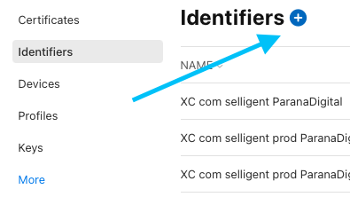
  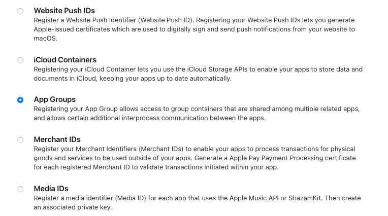
</details>

<details>
  <summary>Create an App Group named "group.yourGroupName".</summary><br/>
    
  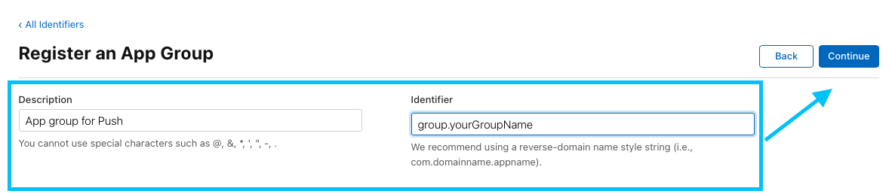
</details>

When this is done, you will need to enable App group capabilities and check `group.yourGroupName` in the Capabilities tab of your main App target.

<details>
  <summary>You can do this either in your Apple Developer Account.</summary><br/>
    
  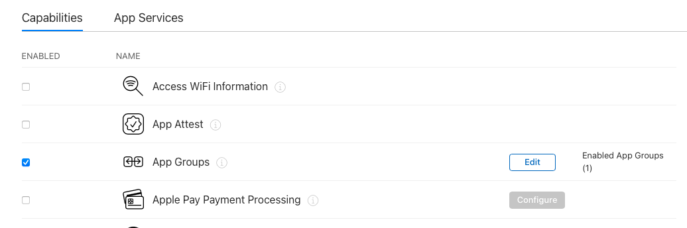
  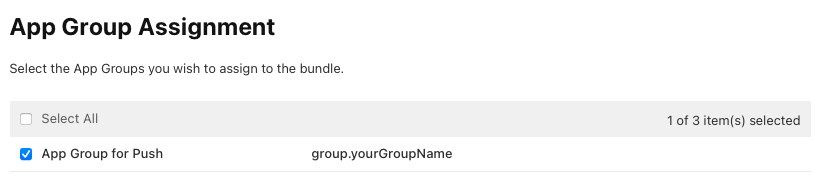
</details>

<details>
  <summary>Or directly in your Xcode project.</summary><br/>
    
  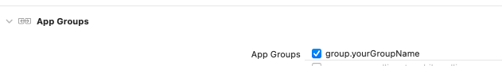
</details>

<a name="service_extension"></a>
### Notification Service Extension
This extension will allow:
* To decrypt a payload before it is provided in the Push banner.
* To download the media of the Rich Push payload.

### Configuration
<details>
  <summary>To get started you will need to add a new target "Notification Service Extension" to your project.</summary><br/>
    
  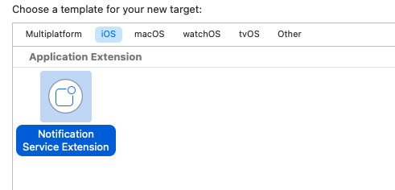
</details>

Note the creation of the files (in Swift in this example):
* `NotificationService.swift`: a subclass of `UNNotificationServiceExtension`.
* `Info.plist`

<details>
  <summary>In the capabilities of your notification service extension target, enable App groups and check "group.yourGroupName".</summary><br/>
    
  
</details>

<details>
  <summary>And finally link the Selligent SDK to the Service Extension target.</summary><br/>
    
  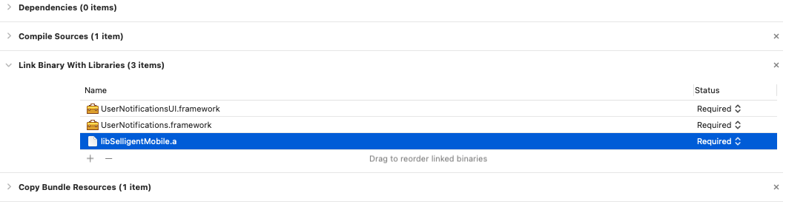
</details>

> Remember, if your target is in swift, do not forget to set the correct path in the `Objective-C bridging-header` property, in the build settings of your target.<br>
> Unless you are using the framework version and importing the module.

### Start the SDK from inside the extension
**Swift**
```swift
let url = "YourProvidedURL"
let clientID = "YourClientID"
let privateKey = "YourPrivateKey"
    
// Create the SMManagerSetting instance
let settings: SMManagerSetting = SMManagerSetting(url: url, clientID: clientID, privateKey: privateKey)
    
// Provide the App Groupd Id to the SDK
settings.appGroupId = "group.yourGroupName"

// Start the SDK
SMManager.sharedInstance().startExtension(with: settings)
```

**Objective-C**
```objective-c
NSString *url = @"YourProvidedURL";
NSString *clientID = @"YourClientID";
NSString *privatKey = @"YourPrivateKey";
    
// Create the SMManagerSetting instance
SMManagerSetting *settings = [SMManagerSetting settingWithUrl:url ClientID:clientID PrivateKey:privatKey];
    
// Provide the App Groupd Id to the SDK
settings.appGroupId = @"group.yourGroupName";

// Start the SDK
[[SMManager sharedInstance] startExtensionWithSetting:settings];
```

### Push notification content modification before displaying to user
Once your service extension is correctly configured and the library is started, the extension will allow you to modify the Push content before displaying it to the user.

This feature is used by the SDK to `decrypt` the payload if it is flagged as encrypted.

You have the possibility to choose between two methods: either you want to manage the call to the block, which is executed with the modified content, by yourself, or you want to let the library manage this for you.

* In the first case, a `UNMutableNotificationContent` object will be returned to you.

**Swift**
```swift
import UserNotifications

class NotificationService: UNNotificationServiceExtension {
    // Storage for the completion handler and content.
    var contentHandler: ((UNNotificationContent) -> Void)?
    var bestAttemptContent: UNMutableNotificationContent?

    override func didReceive(_ request: UNNotificationRequest, withContentHandler contentHandler: @escaping(UNNotificationContent) -> Void) {
        self.contentHandler = contentHandler
        self.bestAttemptContent = (request.content.mutableCopy() as? UNMutableNotificationContent)

        // Init and start the SDK
        let url = "YourProvidedURL"
        let clientID = "YourClientID"
        let privateKey = "YourPrivateKey"
        
        // Create the SMManagerSetting instance
        let settings: SMManagerSetting = SMManagerSetting(url: url, clientID: clientID, privateKey: privateKey)
        
        // Provide the App Group Id to the SDK
        settings.appGroupId = "group.yourGroupName"

        // Start the SDK
        SMManager.sharedInstance().startExtension(with: settings)

        // Provide the request with the original notification content to the SDK and return the updated Notification content
        self.bestAttemptContent = SMManager.sharedInstance().didReceive(request)

        // Call the completion handler when done.
        if let bestAttemptContent = self.bestAttemptContent {
            contentHandler(bestAttemptContent)
        }
    }
    
    // Don't implement if you are not using the Encryption feature
    override func serviceExtensionTimeWillExpire() {
        if let contentHandler = self.contentHandler, let bestAttemptContent = self.bestAttemptContent {
            // Mark the message as still encrypted.
            bestAttemptContent.subtitle = "(Encrypted)"
            bestAttemptContent.body = ""
            contentHandler(bestAttemptContent)
        }
    }
}
```

**Objective-C**
```objective-c
#import "NotificationService.h"
#import "SMHelper.h"

@interface NotificationService()
@property(nonatomic, strong)void(^contentHandler)(UNNotificationContent *contentToDeliver);
@property(nonatomic, strong)UNMutableNotificationContent *bestAttemptContent;
@end

@implementation NotificationService

- (void) didReceiveNotificationRequest:(UNNotificationRequest *)request withContentHandler:(void(^)(UNNotificationContent *_Nonnull))contentHandler {
    self.contentHandler = contentHandler;
    self.bestAttemptContent = request.content.mutableCopy;
    
    // Init and start the SDK
    NSString *url = @"YourProvidedURL";
    NSString *clientID  = @"YourClientID";
    NSString *privatKey = @"YourPrivateKey";
    
    // Create the SMManagerSetting instance
    SMManagerSetting *settings = [SMManagerSetting settingWithUrl:url ClientID:clientID PrivateKey:privatKey];
    
    // Provide the App Group Id to the SDK
    settings.appGroupId = @"group.yourGroupName";

    // Starting the library
    [[SMManager sharedInstance] startExtensionWithSetting:settings];

    // Provide the request with the original notification content to the SDK and return the updated Notification content
    self.bestAttemptContent = [[SMManager sharedInstance] didReceiveNotificationRequest:request];

    // Call the completion handler when done
    contentHandler(self.bestAttemptContent);
}

// Don't implement if you are not using the Encryption feature
- (void) serviceExtensionTimeWillExpire {
    // Mark the message as still encrypted.
    self.bestAttemptContent.subtitle = @"(Encrypted)";
    self.bestAttemptContent.body = @"";
    self.contentHandler(self.bestAttemptContent);
}
 
@end
```
    
* In the second case, the SDK will manage everything.

**Swift**
```swift
import UserNotifications

class NotificationService: UNNotificationServiceExtension {
    override func didReceive(_ request: UNNotificationRequest, withContentHandler contentHandler: @escaping(UNNotificationContent) -> Void) {
        // Init and start the SDK
        let url = "YourProvidedURL"
        let clientID = "YourClientID"
        let privateKey = "YourPrivateKey"

        // Create the SMManagerSetting instance
        let settings: SMManagerSetting = SMManagerSetting(url: url, clientID: clientID, privateKey: privateKey)

        // Provide the App Group Id to the SDK
        settings.appGroupId = "group.yourGroupName"

        // Start the SDK
        SMManager.sharedInstance().startExtension(with: settings)

        // Provide the request with the original Notification content to the SDK and the contentHandler
        SMManager.sharedInstance().didReceive(request, withContentHandler: contentHandler)
    }

    // Don't implement if you are not using the Encryption feature
    override func serviceExtensionTimeWillExpire() {
        // Mark the message as still encrypted.
        SMManager.sharedInstance().serviceExtensionTimeWillExpire()
    }
}
```

**Objective-C**
```objective-c
#import "NotificationService.h"
#import "SMHelper.h"

@implementation NotificationService

- (void) didReceiveNotificationRequest:(UNNotificationRequest *)request withContentHandler:(void(^)(UNNotificationContent *_Nonnull))contentHandler {
    // Init and start the SDK
    NSString *url = @"YourProvidedURL";
    NSString *clientID  = @"YourClientID";
    NSString *privatKey = @"YourPrivateKey";
    
    // Create the SMManagerSetting instance
    SMManagerSetting *settings = [SMManagerSetting settingWithUrl:url ClientID:clientID PrivateKey:privatKey];
    
    // Provide the App Group Id to the SDK
    settings.appGroupId = @"group.yourGroupName";

    // Starting the library
    [[SMManager sharedInstance] startExtensionWithSetting:settings];

    // Provide the request with the original Notification content to the SDK and the contentHandler
    [[SMManager sharedInstance] didReceiveNotificationRequest:request withContentHandler:contentHandler];
}

// Don't implement if you are not using the Encryption feature
- (void) serviceExtensionTimeWillExpire {
    // Mark the message as still encrypted.
    [[SMManager sharedInstance] serviceExtensionTimeWillExpire];
}
 
@end
```

> Remember, if the content can't be decrypted or if `serviceExtensionTimeWillExpire` has been called before decryption is complete, "(Encrypted)" will be the values of all encrypted payload properties (when using Encryption feature). <br>
> If you don't choose to use encryption feature, do not call SDK `serviceExtensionTimeWillExpire` and let the original push payload to be used.

For more information on Notification service extension you can also refer to [Apple documentation](https://developer.apple.com/documentation/usernotifications/modifying_content_in_newly_delivered_notifications).

<a name="content_extension"></a>
### Notification Content Extension
This extension will:
* Provide to you the content of the Rich Push media (if the extension is not present and depending on the type of the media, iOS will use a default template to display the message, but in this case the action buttons won't be displayed).
* Display action buttons in the Push.

> This Extension is triggered when performing a `long press` or `3D touch` in a Push Notification.

### Configuration
<details>
  <summary>To get started you will need to add a new target "Notification Content Extension" to your project.</summary><br/>
    
  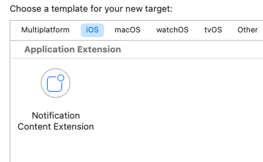
</details>

You will notice the creation of those files (in Objective C in this example):
* `MainInterface.storyboard`: where you will be able to design the notification.
* `NotificationViewController.m`: an `UIViewController` subclassz
* `Info.plist`.

<details>
  <summary>In the capabilities of your target enable App groups and check "group.yourGroupName".</summary><br/>
    
  
</details>

Now you will need to associate the Extension with a Selligent Notification Category.

A category is a property inside the payload that will inform your App which extension should manage the content of the payload.

It is mandatory to have one once a button is present in the payload and should be displayed in the notification center.

By default, the Selligent category will be `SELLIGENT_BUTTON`. If you plan to also send Rich Push, Selligent provides you the ability to have a specific extension to manage the way you want to display it in the UI. The category will be named `SELLIGENT_IMAGE` in this case.

To set the category in your content extension, just open the `Info.plist` of the extension, find the `NSExtensionAttributes` dictionary and set the value of the `UNNotificationExtensionCategory` Key to `SELLIGENT_BUTTON` or `SELLIGENT_IMAGE`.

<details>
  <summary>You can also have both category in one extension as `UNNotificationExtensionCategory` can be an Array type.</summary><br/>
    
  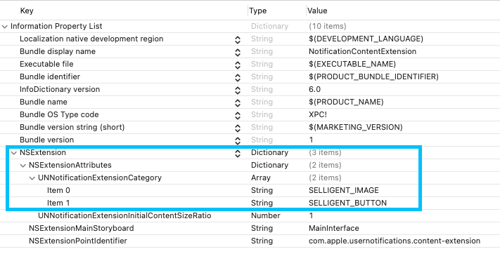
</details>

<details>
  <summary>And finally link the Selligent SDK to the Content Extension target.</summary><br/>
    
  
</details>

> Remember, if your target is in swift, do not forget to set the correct path in the `Objective-C bridging-header` property, in the build settings of your target.<br>
> Unless you are using the framework version and importing the module.

The storyboard will allow you to customise the display of the Push Notifications.

If you want to keep the default one, just hide the `UIView` created by default and do not set the `UNNotificationExtensionDefaultContentHidden` Key. On the other hand, set the Key to `YES` and customise the display of the body and title of your notification.

For more information about Notification Content Extensions please check the [Apple documentation](https://developer.apple.com/documentation/usernotificationsui/customizing_the_appearance_of_notifications).

### Start the SDK from inside the extension
<details>
  <summary>If you have correctly added a Selligent Notification Content Extension target to your project, you will be able to display Rich Push media and action buttons directly in the Push Notification.</summary><br/>
    
  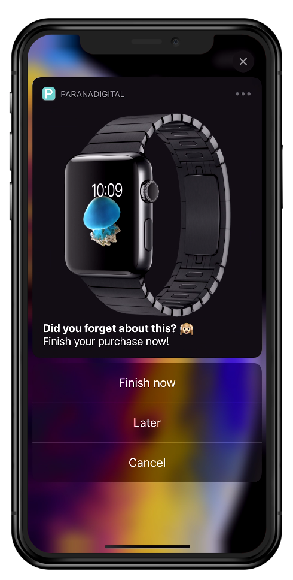
</details>

> Do note that if you want to support `GIF` format you will need to implement it on your own, from the provided image `NSData`.

**Swift**
```swift
import UIKit
import UserNotifications
import UserNotificationsUI

class NotificationViewController: UIViewController, UNNotificationContentExtension {
    // UI elements from the storyboard
    @IBOutlet var titleLabel: UILabel?
    @IBOutlet var bodyLabel: UILabel?
    @IBOutlet weak var imageView: UIImageView!
    
    override func viewDidLoad() {
        super.viewDidLoad()
        // Do any required interface initialization here.
    }

    func didReceive(_ notification: UNNotification) {
        // UI elements from the storyboard
        self.titleLabel?.text = notification.request.content.title
        self.bodyLabel?.text = notification.request.content.body
    
        // "SELLIGENT_IMAGE" category must be configured
        if (notification.request.content.attachments.count > 0) {
            let attachment: UNNotificationAttachment = notification.request.content.attachments[0];

            if (attachment.url.startAccessingSecurityScopedResource()) {
                let imageData = NSData(contentsOf: attachment.url)
                let image = UIImage(data: imageData! as Data)

                self.imageView.image = image
                attachment.url.stopAccessingSecurityScopedResource()
            }
        }

        // Init and start the SDK
        let url = "YourProvidedURL"
        let clientID = "YourClientID"
        let privateKey = "YourPrivateKey"

        // Create the SMManagerSetting instance
        let settings: SMManagerSetting = SMManagerSetting(url: url, clientID: clientID, privateKey: privateKey)

        // Provide the App Group Id to the SDK
        settings.appGroupId = "group.yourGroupName"

        // Start the SDK
        SMManager.sharedInstance().startExtension(with: settings)
        
        // SDK API to add Push Notification buttons
        // "SELLIGENT_BUTTON" category must be configured
        SMManager.sharedInstance().didReceive(notification)
    }
    
    // If you want the Push Notification buttons to be processed without the need of opening the App
    // Make sure you have read the Universal Links section of the documentation before implementing this
    func didReceive(_ response: UNNotificationResponse, completionHandler completion: @escaping(UNNotificationContentExtensionResponseOption) -> Void) {
        SMManager.sharedInstance().didReceive(response, withCompletionHandler: completion)
        
        // OR
        // If you want to handle the completion handler on your own
        // SMManager.sharedInstance().didReceive(response)
        // completion(.dismiss)
    }
}
```

**Objective-C**
```objective-c
#import "NotificationViewController.h"
#import <UserNotifications/UserNotifications.h>
#import <UserNotificationsUI/UserNotificationsUI.h>
#import "SMHelper.h"

@interface NotificationViewController () <UNNotificationContentExtension>
// UI elements from the storyboard
@property(weak, nonatomic)IBOutlet UILabel *titleLabel;
@property(weak, nonatomic)IBOutlet UILabel *bodyLabel;
@property(weak, nonatomic)IBOutlet UIImageView *imageView;

@end
     
@implementation NotificationViewController

- (void) viewDidLoad {
    [super viewDidLoad];
    // Do any required interface initialization here.
}
 
- (void) didReceiveNotification:(UNNotification *)notification {
    self.titleLabel.text = notification.request.content.title;
    self.bodyLabel.text = notification.request.content.body;
    
    // "SELLIGENT_IMAGE" category must be configured
    if (notification.request.content.attachments.count > 0) {
        UNNotificationAttachment *attachment = notification.request.content.attachments[0];
        
        if (attachment.URL.startAccessingSecurityScopedResource) {
            NSData *imageData = [NSData dataWithContentsOfURL:attachment.URL];
            UIImage *image = [UIImage imageWithData:imageData];
            
            self.imageView.image = image;
            [attachment.URL stopAccessingSecurityScopedResource];
        }
    }
    
    // Init and start the SDK
    NSString *url = @"YourProvidedURL";
    NSString *clientID  = @"YourClientID";
    NSString *privatKey = @"YourPrivateKey";
    
    // Create the SMManagerSetting instance
    SMManagerSetting *settings = [SMManagerSetting settingWithUrl:url ClientID:clientID PrivateKey:privatKey];
    
    // Provide the App Group Id to the SDK
    settings.appGroupId = @"group.yourGroupName";

    // Starting the library
    [[SMManager sharedInstance] startExtensionWithSetting:settings];

    // SDK API to add Push Notification buttons
    // "SELLIGENT_BUTTON" category must be configured
    [[SMManager sharedInstance] didReceiveNotification:notification];
}

// If you want the Push Notification buttons to be processed without the need of opening the App
// Make sure you have read the Universal Links section of the documentation before implementing this
- (void) didReceiveNotificationResponse:(UNNotificationResponse *)response completionHandler:(void(^)(UNNotificationContentExtensionResponseOption option))completion {
    [[SMManager sharedInstance] didReceiveNotificationResponse:response withCompletionHandler:completion];
    
    // OR
    // If you want to handle the completion handler on your own
    // [[SMManager sharedInstance] didReceiveNotificationResponse:response];
    // completion(UNNotificationContentExtensionResponseOptionDismiss);
} 
    
@end
```
